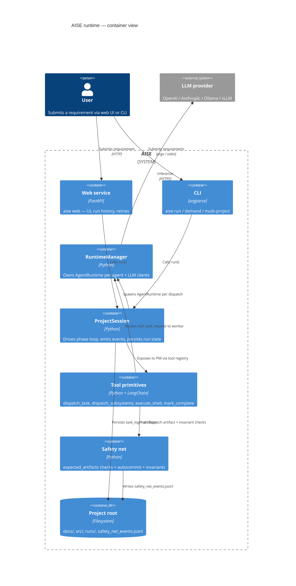
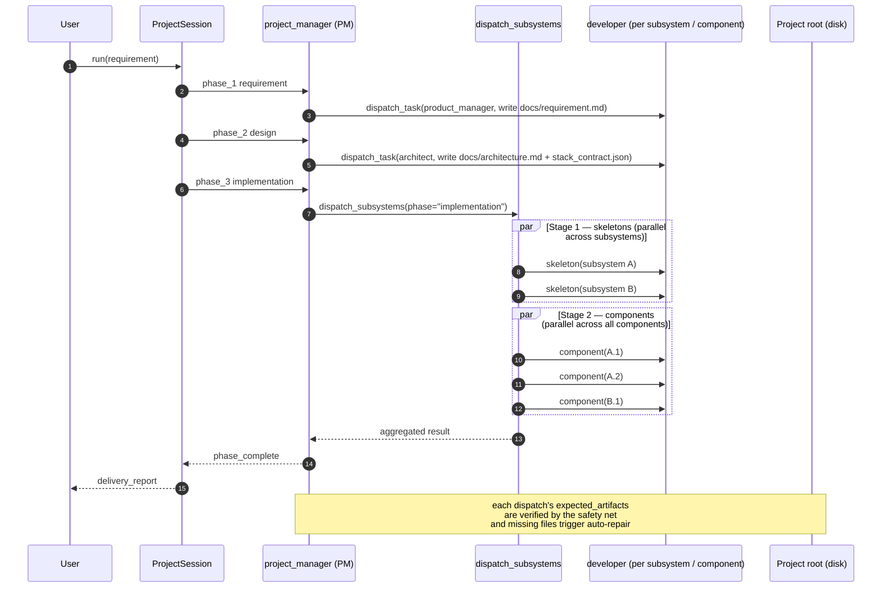

# AISE - Multi-Agent Software Development Team

A multi-agent AI system that simulates a complete software development team. Specialized agents collaborate through message-passing to deliver the full software development lifecycle — from requirements gathering to testing.

## Overview

AISE orchestrates six specialized agents, each with distinct skills, through a structured workflow pipeline. Agents communicate via a publish-subscribe message bus and produce versioned artifacts that flow through review gates before advancing to the next phase. An **RD Director** bootstraps each project by forming the team and distributing the initial requirements. A **Project Manager** then oversees execution, tracks progress, manages releases, monitors team health, and resolves conflicts throughout the lifecycle.

## Architecture

The runtime is layered around a single `ProjectSession` that drives the
LLM-orchestrated waterfall (or agile sprint) lifecycle. Both the web
service (`aise web`) and the CLI (`aise run`, `aise demand`,
`aise multi-project`) construct a `RuntimeManager`, hand it to a
`ProjectSession`, and call `session.run(requirement)`. The Project
Manager agent emits tool calls (`dispatch_task`, `dispatch_subsystems`)
via A2A `task_request` / `task_response` envelopes to worker agents.





## Features

### RD Director — Project Bootstrap

The RD Director is the entry point for every project:

- **Team formation** — Define roles, agent counts, LLM model per role, and development mode (local or GitHub) before work begins.
- **Requirement distribution** — Formally hand off product requirements and architecture requirements to the team as a single authoritative source.

### Project Manager — Execution & Oversight

The Project Manager keeps the project on track throughout its lifecycle without owning task decomposition or assignment:

- **Progress tracking** — Report phase completion and overall delivery percentage at any point.
- **Version release** — Coordinate a release: validate readiness (required artifacts present), record release notes, and notify the team.
- **Team health** — Produce a health score from blocked and overdue tasks, flag risk factors, and recommend corrective actions.
- **Conflict resolution** — Mediate inter-agent disagreements using NFR-aligned heuristics.

### WhatsApp Group Chat Integration

Form a WhatsApp group where agents collaborate in real time. Human owners can join the group and send requirements directly in chat. Includes a bidirectional bridge between the internal MessageBus and WhatsApp, a webhook server for the WhatsApp Business API, and a local CLI simulation mode for testing without credentials.

```bash
# Start a WhatsApp group session (simulation mode)
aise whatsapp --project-name "UserAPI" --owner "Alice"

# Start with real WhatsApp Business API
aise whatsapp --project-name "UserAPI" --owner "Alice" \
  --phone "+1234567890" --webhook --webhook-port 8080
```

### On-Demand CLI Mode

`aise demand` runs a single project end-to-end through `ProjectSession`,
the same engine used by `aise web`. Pass the requirement on the command
line or pipe it via stdin; the result and a `projects/<slug>/` directory
of artifacts (docs, source, runs/) are produced once the workflow
completes.

```bash
# Provide the requirement inline:
aise demand --project-name "UserAPI" --requirements "Build a REST API for user management"

# Or read it from stdin:
aise demand --project-name "UserAPI"  # then type/paste the requirement and Ctrl-D

# Or load it from a file:
aise demand --project-name "UserAPI" --requirements ./requirements.txt
```

For multi-project work where you want to run several requirements in one
shell, use `aise multi-project` (see the *Usage* section below).

### Per-Agent Configurable LLM Models

Each agent can use a different LLM provider and model. The configuration supports a fallback chain: agent-specific settings take priority, then project defaults, then hardcoded defaults.

```python
from aise.config import ProjectConfig, ModelConfig

config = ProjectConfig(
    project_name="UserAPI",
    default_model=ModelConfig(provider="anthropic", model="claude-opus-4")
)
config.agents["developer"].model = ModelConfig(
    provider="openai", model="gpt-4o"
)
```

Supported providers include OpenAI, Anthropic, Ollama, and any OpenAI-compatible API.

### CI/CD Pipeline

GitHub Actions workflow that runs on every pull request and push to `main`:

- **Lint** — Ruff check and format validation
- **Test** — Pytest across Python 3.11 and 3.12
- **Build** — Package building and verification

## Agents & Skills

| Agent | Role | Skills |
|-------|------|--------|
| **RD Director** | Project bootstrap | Team Formation, Requirement Distribution |
| **Project Manager** | Project execution & oversight | Conflict Resolution, Progress Tracking, Version Release, Team Health |
| **Product Manager** | Requirements & product vision | Requirement Analysis, User Story Writing, Product Design, Product Review |
| **Architect** | System design & technical decisions | System Design, API Design, Tech Stack Selection, Architecture Review |
| **Developer** | Implementation & code quality | Code Generation, Unit Test Writing, Code Review, Bug Fix |
| **QA Engineer** | Testing strategy & automation | Test Plan Design, Test Case Design, Test Automation, Test Review |

## Workflow Pipeline

The default SDLC workflow has four phases, each with a review gate:

```
Requirements ──► Design ──► Implementation ──► Testing
     │              │              │               │
  product_review  arch_review   code_review    test_review
```

Phases advance only after artifacts pass their review gate (up to 3 iterations).

The Project Manager operates cross-cutting to the pipeline, available for progress queries, conflict resolution, team health checks, and version releases at any point during delivery.

## Installation

**Requirements:** Python 3.11+

```bash
# Clone the repository
git clone https://github.com/NightStaker/AISE.git
cd AISE

# Install in development mode
pip install -e .

# Install with development dependencies (pytest, ruff)
pip install -e ".[dev]"
```

## Usage

### Global Project Config (Optional)

You can place a global default config at `config/global_project_config.json`.
Use `config/global_project_config.example.json` as a template.

`aise multi-project` is a small REPL backed by the same `ProjectSession`
runtime as `aise run`. It supports the following commands:

| Command | Description |
| ---     | ---         |
| `create <name>`     | Create `projects/<slug>/` and switch to it |
| `list`              | List known projects in this REPL session |
| `switch <name>`     | Make `<name>` the current project |
| `run <requirement>` | Run `ProjectSession` against the current project |
| `help` / `quit`     | Show commands / exit |

The global default config (if present) is loaded once at REPL startup;
each `run` invocation writes to its target project root.

### Run a development workflow

```bash
aise run --requirements "Build a REST API for user management" --project-name "UserAPI"
```

### Save results to a file

```bash
aise run --requirements "requirements text" --project-name "MyProject" --output results.json
```

### Start an interactive session

```bash
aise demand --project-name "MyProject"
```

### Start a WhatsApp group session

```bash
aise whatsapp --project-name "MyProject" --owner "Alice"
```

### Start the Web project management system

Install web dependencies first:

```bash
pip install -e ".[web]"
```

Run:

```bash
aise web --host 0.0.0.0 --port 8000
```

OAuth environment variables:

```bash
GOOGLE_CLIENT_ID=...
GOOGLE_CLIENT_SECRET=...
MICROSOFT_CLIENT_ID=...
MICROSOFT_CLIENT_SECRET=...
```

Web features:
- Dashboard with all project overviews
- Global config editor and new-project entry
- Project detail with workflow nodes, per-node tasks, and task details
- Historical requirements and requirement dispatch
- Google/Microsoft account login
- JSON API endpoints for async frontend updates
- Persistent run/requirement history in `projects/web_state.json`
- Built-in local super admin account (`admin` / `123456`) with `rd_director` permission
- Friendly global-config UI for model catalog management
- Agent model dropdown selection on project creation
- Global config center with left navigation: `Models / Agents / Workspace / Logging / Raw JSON`
- `Models` supports multiple providers per model, default provider selection, and provider failover order
- `Models` now separates `Providers` configuration from `Models` binding; local models can be marked `is_local` and skip providers
- `Models` supports OpenAI-style model metadata (`name`, `api_model`, `extra`)
- Project creation supports optional `initial_requirement`; if provided, workflow is executed immediately

Main JSON APIs:
- `GET /api/projects`
- `POST /api/projects`
- `GET /api/projects/{project_id}`
- `GET /api/projects/{project_id}/requirements`
- `POST /api/projects/{project_id}/requirements`
- `GET /api/projects/{project_id}/runs`
- `GET /api/projects/{project_id}/runs/{run_id}`
- `GET /api/projects/{project_id}/runs/{run_id}/phases/{phase_idx}/tasks/{task_key}`
- `GET /api/config/global`
- `POST /api/config/global`
- `GET /api/config/global/data`
- `POST /api/config/global/data`

Optional dev login for local testing:

```bash
export AISE_WEB_ENABLE_DEV_LOGIN=true
```

Override built-in admin credentials (recommended for non-local environments):

```bash
export AISE_ADMIN_USERNAME=admin
export AISE_ADMIN_PASSWORD=change-me
```

### View team information

```bash
aise team
aise team --verbose
```

## Project Structure

```
src/aise/
├── main.py              # CLI entry point
├── config.py            # Configuration management
├── core/
│   ├── agent.py         # Base Agent class & AgentRole enum
│   ├── artifact.py      # Artifact & ArtifactStore models
│   ├── llm.py           # LLMClient abstraction
│   ├── message.py       # Message, MessageBus, MessageType
│   ├── orchestrator.py  # Workflow coordinator
│   ├── session.py       # OnDemandSession (interactive mode)
│   ├── skill.py         # Skill base class & SkillContext
│   └── workflow.py      # Workflow engine, Phase & Task models
├── agents/              # 6 agent implementations
├── skills/              # 22 skill implementations
│   ├── manager/         # RD Director skills (team_formation, req_distribution)
│   ├── lead/            # Project Manager skills (conflict, progress, release, health)
│   ├── pm/
│   ├── architect/
│   ├── developer/
│   └── qa/
└── whatsapp/            # WhatsApp group chat integration
    ├── client.py        # WhatsApp Business Cloud API client
    ├── group.py         # Group chat model & member management
    ├── bridge.py        # MessageBus ↔ WhatsApp bridge
    ├── webhook.py       # Webhook server for incoming messages
    └── session.py       # WhatsApp group session orchestrator
```

## Testing

```bash
# Run all tests
pytest

# Run core framework tests
pytest tests/test_core/

# Run agent tests
pytest tests/test_agents/

# Run WhatsApp integration tests
pytest tests/test_whatsapp/

# Lint and format check
ruff check src/ tests/
ruff format --check src/ tests/
```

## Key Concepts

- **Message Bus** — Decoupled pub-sub communication between agents
- **Artifacts** — Versioned, typed work products (requirements, code, tests, etc.) with status tracking (Draft → In Review → Approved/Rejected)
- **Review Gates** — Quality checkpoints between workflow phases with configurable retry limits
- **Stateless Skills** — Each skill is a pure function of input artifacts and context, producing output artifacts
- **Declarative Workflows** — Pipeline phases defined as data structures with dependency tracking
- **LLM Abstraction** — Provider-agnostic model access allowing heterogeneous agent configurations
- **RD Director Bootstrap** — Project setup (team composition, model assignments, development mode, and initial requirements) is handled before the delivery pipeline begins
- **Project Manager Oversight** — Dedicated execution oversight (progress, releases, team health, conflicts) without owning task decomposition or assignment

## License

MIT License. See [LICENSE](LICENSE) for details.
