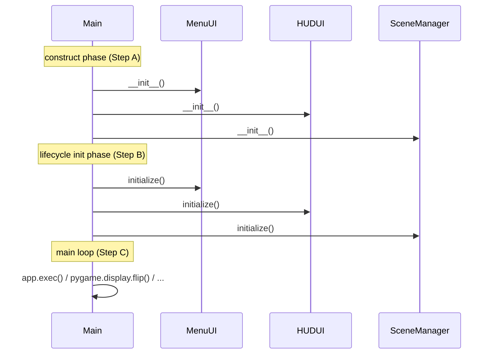

# Lifecycle Init Contract Skill

## When to Use

Use this skill during phase-2 architecture, immediately after you
have decomposed the system into subsystems and components and have
declared their public APIs. The output of this skill becomes part of
`docs/stack_contract.json` and `docs/architecture.md`.

## Why this skill exists

Every component class either:

- (a) has a cheap, total constructor that fully prepares the object
  for use, or
- (b) uses a **two-phase construct/initialize** pattern — the
  constructor does minimal work, and a separate public method
  (`initialize()`, `setup()`, `start()`, `bootstrap()`,
  `init_async()`, ...) loads fonts, opens sockets, allocates GPU
  resources, registers event handlers, etc.

Pattern (b) is common and often necessary — pygame fonts can't be
loaded before `pygame.init()`, sockets shouldn't be bound until the
config is parsed, GPU contexts shouldn't be created during `__init__`
because tests run against partial mocks. **But pattern (b) creates a
hand-off problem**: the entry-point developer must know *which*
components use it and call their second phase explicitly. If the
architecture document does not enumerate them, the entry-point
developer will skip the call, the per-component unit tests still
pass (they construct the object themselves), and the application
ships with uninitialized components.

This skill closes the gap by making the lifecycle list a first-class
contract artifact.

## Mandatory output

### 1. `lifecycle_inits[]` array in `docs/stack_contract.json`

Add this top-level array alongside the existing fields. Each entry
records one class instance the entry file MUST initialise:

```json
"lifecycle_inits": [
  {
    "attr": "<member name on the entry-point class — e.g. 'menu', 'snake', 'audio'>",
    "method": "<public method to invoke — e.g. 'initialize', 'setup', 'start'>",
    "class": "<class name — e.g. 'MenuUI', 'SnakeEngine'>",
    "module": "<source file path — e.g. 'src/ui/menu_ui.py'>"
  }
]
```

Rules:

- **Every** class declared in `subsystems[].components[]` whose
  public API contains a method with body more than `pass` and a name
  in {`initialize`, `setup`, `start`, `bootstrap`, `init_async`,
  `init`, `prepare`, `open`, `connect`} MUST appear in
  `lifecycle_inits[]`. Match by walking your own architecture
  document — it is your authoritative source.
- The order in `lifecycle_inits[]` is the order the entry file MUST
  call them. Put framework-context owners (e.g. the renderer that
  calls `pygame.init()`) first; put consumers of that context next.
- Do NOT include private methods (those whose name starts with `_`),
  pure value objects with no resources to initialise, or methods that
  exist solely as test hooks.
- If the project has zero such classes (all constructors are total),
  set `lifecycle_inits` to `[]` explicitly. The empty array signals
  "I checked, no second-phase init is required" — the validator
  treats an absent field differently from an empty one.

### 2. Boot sequence diagram in `docs/architecture.md`

Add a Mermaid `sequenceDiagram` (NOT a `C4Dynamic`) describing the
boot path. It MUST contain one arrow per `lifecycle_inits[]` entry:



Every entry in `lifecycle_inits[]` MUST appear as an arrow under the
"lifecycle init phase" section. The two artifacts must agree
verbatim — the order must match, the participant names must
correspond to the `attr` / `class` fields. Any divergence is a
contract violation and the safety net will re-dispatch you.

### 3. Component contract: `_initialized` flag

When you write the per-component skeletons (architect post-document
step 3), every class that declares an `initialize()` method MUST
also declare:

- A `self._initialized: bool = False` field set in `__init__`.
- An assignment `self._initialized = True` as the last line of
  `initialize()`.

This lets the developer's entry-point self-check (Step D in
`entry_point_wiring`) verify the call chain reached every
component. Without the flag, "did Step B run?" is unobservable
from outside the class.

## Validation

The safety net validates this contract at three layers:

1. **Schema** — `docs/stack_contract.json` is parsed; every entry
   in `lifecycle_inits[]` must have non-empty `attr`, `method`,
   `class`, `module` strings, and `module` must match a path
   declared in `subsystems[].components[].file`.
2. **Sequence diagram** — the boot `sequenceDiagram` block in
   `docs/architecture.md` must contain a `Main->>...: <method>()`
   arrow for every `lifecycle_inits[]` entry (the safety net's
   architecture-phase check looks for them).
3. **Entry file** — after `step_integrate_main`, the entry file's
   AST is walked and every `<attr>.<method>()` call must be
   present (or a deterministic loop over `lifecycle_inits[]` must
   exist). See `safety_net/entry_point.py`.

A miss at any layer triggers a re-dispatch of the responsible
agent (architect → developer → developer respectively) with the
precise diff, so the contract converges within at most one extra
round per layer.
