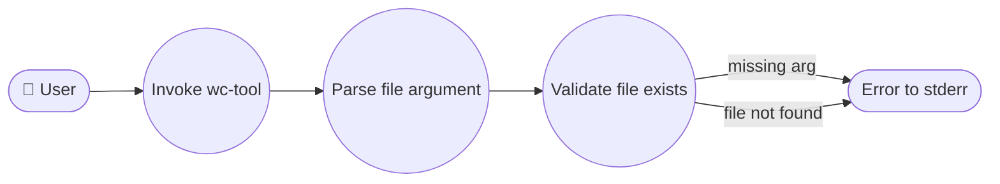
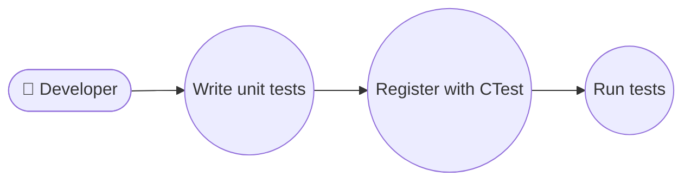

# Requirement Specification — wc-tool

## 功能需求

### FR-001: File Input and Argument Parsing

The tool accepts a single positional argument that specifies the path to the file to be
analysed.

- **FR-001.1** The tool MUST accept exactly one file path argument on the command line.
- **FR-001.2** If no argument is provided, the tool MUST print an error message to
  **stderr** and exit with a non-zero status code.
- **FR-001.3** If the file does not exist or cannot be opened, the tool MUST print an
  error message to **stderr** and exit with a non-zero status code.

### FR-002: Line Count

The tool MUST count the number of newline characters (`\n`) in the file and report the
result as the first integer in its output.

- **FR-002.1** Each newline character (`\n`) in the file contributes exactly one to the
  line count.
- **FR-002.2** A file that is empty (zero bytes) MUST produce a line count of `0`.
- **FR-002.3** A file whose last character is not a newline MUST still be counted as
  containing one additional line (matching `wc` semantics).

### FR-003: Word Count

The tool MUST count the number of whitespace-delimited words in the file.

- **FR-003.1** A word is defined as a maximal sequence of non-whitespace characters.
  Whitespace characters are those recognised by `std::isspace` (space, tab, newline,
  carriage return, form feed, vertical tab).
- **FR-003.2** Empty files MUST produce a word count of `0`.
- **FR-003.3** Multiple consecutive whitespace characters MUST NOT produce extra words.

### FR-004: Byte Count

The tool MUST report the total number of bytes in the file.

- **FR-004.1** The byte count is the file size in bytes as reported by the operating
  system (e.g. `std::filesystem::file_size` or reading until EOF).
- **FR-004.2** An empty file MUST produce a byte count of `0`.

### FR-005: Output Format

The tool MUST print three integers (lines, words, bytes) separated by single spaces,
followed by the filename, to stdout.

- **FR-005.1** The output format is: `<lines> <words> <bytes> <filename>`
- **FR-005.2** Fields are separated by exactly one space.
- **FR-005.3** The filename printed is the user-provided argument, not a canonicalised path.

### FR-006: Build System

The project MUST be buildable with CMake using C++17 as the strict language standard,
producing a single static binary with no runtime dependencies.

- **FR-006.1** A `CMakeLists.txt` file exists at the project root.
- **FR-006.2** The build system enforces C++17 via `set(CMAKE_CXX_STANDARD 17)`.
- **FR-006.3** The build produces a single static binary with no runtime dependencies.

### FR-007: Unit Tests

The project MUST include unit tests for each counting primitive using the CTest framework
with no third-party dependencies.

- **FR-007.1** Separate test executables exist for line-count, word-count, and byte-count.
- **FR-007.2** Tests are registered with `add_test` in CMake.
- **FR-007.3** No third-party testing frameworks are used.

## 非功能需求

### NFR-001: Performance

The tool reads the input file exactly once, processes files of at least 1 GB within
30 seconds on standard hardware, and uses O(1) memory with respect to file size
via streaming read.

### NFR-002: Portability

The tool compiles and runs on Linux (glibc) and macOS (Apple clang) using C++17,
and is relocatable with no hardcoded paths.

### NFR-003: Reliability

The tool handles binary files gracefully without crashing and does not produce
undefined behaviour on empty files, very large files, or files with unusual encodings.

## 用例

### UC-001: Count File Statistics

**Actor:** User
**Goal:** Obtain line, word, and byte counts for a given file.
**Preconditions:** A file exists and is readable.
**Main Flow:**
1. User invokes `wc-tool <file_path>`.
2. The tool opens the file for reading.
3. The tool reads the file once, counting lines, words, and bytes.
4. The tool prints the results to stdout.

Covers: FR-001, FR-002, FR-003, FR-004, FR-005

### UC-002: Handle Missing File Argument

**Actor:** User
**Goal:** Receive an error message when no file argument is provided.
**Preconditions:** None.
**Main Flow:**
1. User invokes `wc-tool` without arguments.
2. The tool detects the missing argument.
3. The tool prints an error message to stderr.
4. The tool exits with a non-zero status code.

Covers: FR-001

### UC-003: Handle Non-Existent File

**Actor:** User
**Goal:** Receive an error message when the specified file does not exist.
**Preconditions:** None.
**Main Flow:**
1. User invokes `wc-tool <nonexistent_file>`.
2. The tool attempts to open the file.
3. The tool detects the file does not exist.
4. The tool prints an error message to stderr.
5. The tool exits with a non-zero status code.

Covers: FR-001
