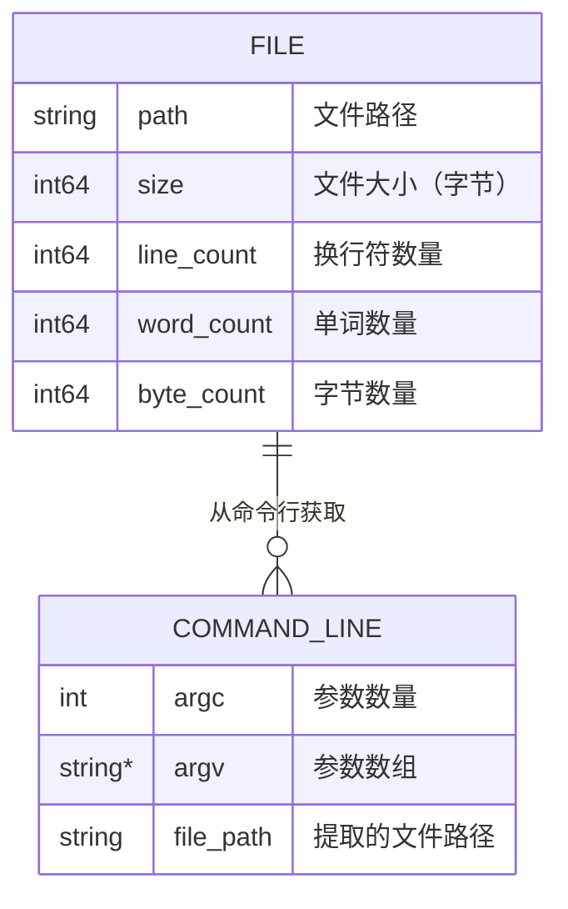
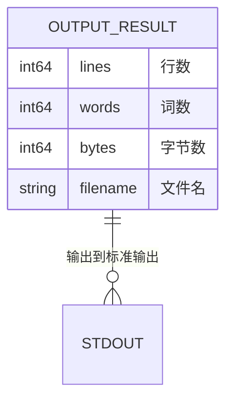
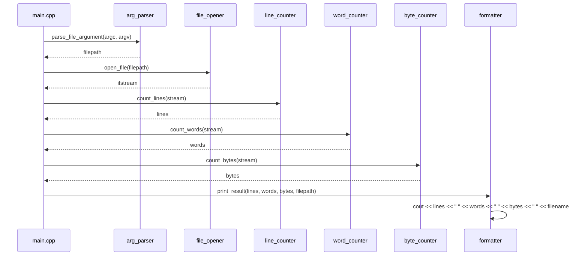
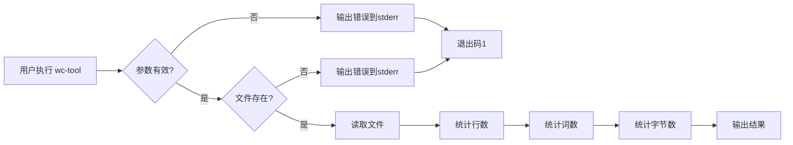
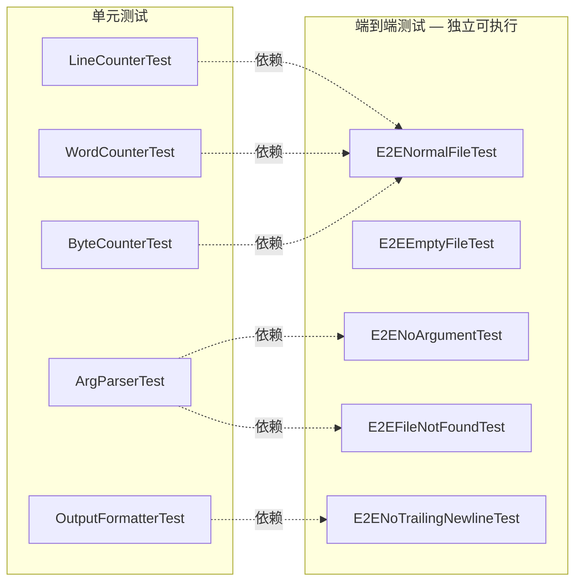
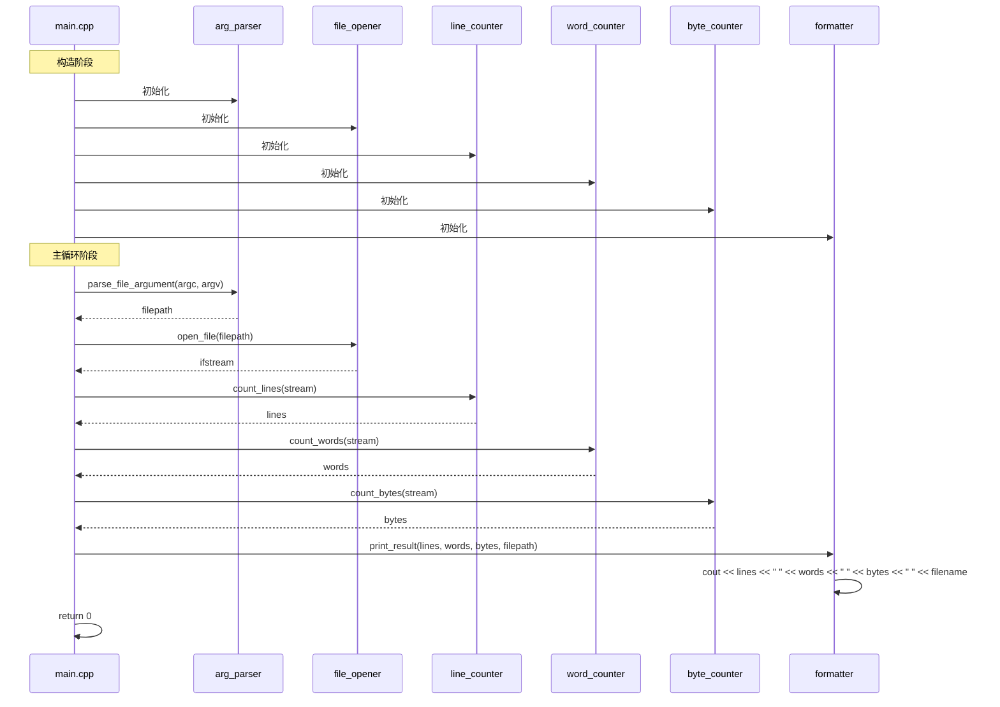

# wc-tool 架构设计文档

## 1. 概述

本文档描述 wc-tool — 一个类 Unix `wc` 命令行工具 — 的架构设计。该工具读取指定文件，统计行数、单词数和字节数，并将结果输出到标准输出。

## 2. 技术栈

| 项目 | 选择 | 理由 |
|------|------|------|
| 语言 | C++17 | 标准库提供完整的文件系统、流处理、字符串处理能力 |
| 构建系统 | CMake | 跨平台构建，与CTest原生集成，支持C++17标准 |
| 测试框架 | CTest + cassert | 标准库断言，无第三方依赖，与CMake原生集成 |
| 运行时依赖 | 无 | 仅使用C++标准库，单静态二进制，无动态链接 |
| 代码风格 | C++17 严格模式 | 启用C++17，禁用扩展，确保可移植性 |

## 3. 系统上下文 (C4 Context)

```mermaid
C4Context
  title System Context - wc-tool
  Person(user, "用户", "在命令行中运行wc-tool的终端用户")
  System(wc_tool, "wc-tool", "命令行单词计数工具", "统计文件的行数、单词数和字节数")
  System_Ext(file_system, "文件系统", "本地文件系统，提供输入文件")
  System_Ext(shell, "命令行Shell", "Unix/Linux/macOS终端环境")

  Rel(user, shell, "执行")
  Rel(shell, wc_tool, "启动并传递参数")
  Rel(wc_tool, file_system, "读取文件")
  Rel(wc_tool, user, "输出结果到stdout")
  
  UpdateLayoutConfig()
```

## 4. 容器分解 (C4 Container)

```mermaid
C4Container
  title Container View - wc-tool
  System_Boundary(app, "wc-tool 应用") {
    Component(main, "main.cpp", "入口点，协调各子系统", "C++")
    Component(arg_parser, "arg_parser.cpp", "解析并验证命令行参数", "C++")
    Component(file_opener, "file_opener.cpp", "打开文件流", "C++")
    Component(line_counter, "line_counter.cpp", "统计换行符数量", "C++")
    Component(word_counter, "word_counter.cpp", "统计单词数量", "C++")
    Component(byte_counter, "byte_counter.cpp", "统计字节数量", "C++")
    Component(formatter, "formatter.cpp", "格式化输出结果", "C++")
  }
  
  Rel(main, arg_parser, "调用")
  Rel(main, file_opener, "调用")
  Rel(main, line_counter, "调用")
  Rel(main, word_counter, "调用")
  Rel(main, byte_counter, "调用")
  Rel(main, formatter, "调用")
  
  UpdateLayoutConfig()
```

## 5. 组件分解 (C4 Component)

```mermaid
C4Component
  title Component View - 内部组件关系
  Container_Boundary(input_boundary, "输入子系统") {
    Component(arg_parser, "arg_parser", "解析并验证命令行参数", "C++")
    Component(file_opener, "file_opener", "打开文件流", "C++")
  }
  
  Container_Boundary(counter_boundary, "计数子系统") {
    Component(line_counter, "line_counter", "统计换行符数量", "C++")
    Component(word_counter, "word_counter", "统计单词数量", "C++")
    Component(byte_counter, "byte_counter", "统计字节数量", "C++")
  }
  
  Container_Boundary(output_boundary, "输出子系统") {
    Component(formatter, "formatter", "格式化输出结果", "C++")
  }
  
  Rel(main, arg_parser, "parse_file_argument", "参数验证")
  Rel(main, file_opener, "open_file", "文件打开")
  Rel(main, line_counter, "count_lines", "行计数")
  Rel(main, word_counter, "count_words", "词计数")
  Rel(main, byte_counter, "count_bytes", "字节计数")
  Rel(main, formatter, "print_result", "结果输出")
  
  UpdateLayoutConfig()
```

## 6. 数据模型

### 6.1 输入数据



### 6.2 输出数据

输出格式：`<lines> <words> <bytes> <filename>`



## 7. 模块依赖关系

```mermaid
flowchart TD
    subgraph src ["src/"]
        main["src/main.cpp"]
        input["src/input/"]
        counter["src/counter/"]
        output["src/output/"]
    end
    
    main --> input
    main --> counter
    main --> output
    counter --> input
    
    UpdateLayoutConfig()
```

## 8. 组件交互流程

### 8.1 主流程



### 8.2 错误处理流程



## 9. 测试架构

### 9.1 单元测试

| 测试名称 | 测试可执行文件 | 测试内容 | CTest 名称 |
|----------|---------------|---------|-----------|
| 行计数 | test_line_counter | FR-002 | LineCounterTest |
| 单词计数 | test_word_counter | FR-003 | WordCounterTest |
| 字节计数 | test_byte_counter | FR-004 | ByteCounterTest |
| 参数解析 | test_arg_parser | FR-001 | ArgParserTest |
| 输出格式化 | test_output_formatter | FR-005 | OutputFormatterTest |

### 9.2 端到端测试 — 独立可执行

每个端到端场景拥有**独立的测试可执行文件**和**唯一的 CTest 测试名**，确保可以通过 `ctest -R <name>` 单独执行：

| 场景 ID | 描述 | CTest 名称 | 测试可执行文件 |
|---------|------|-----------|---------------|
| e2e_normal_file | 正常文件处理 | E2ENormalFileTest | test_e2e_normal_file |
| e2e_empty_file | 空文件处理 | E2EEmptyFileTest | test_e2e_empty_file |
| e2e_no_argument | 缺少参数 | E2ENoArgumentTest | test_e2e_no_argument |
| e2e_file_not_found | 文件不存在 | E2EFileNotFoundTest | test_e2e_file_not_found |
| e2e_no_trailing_newline | 无尾部换行符 | E2ENoTrailingNewlineTest | test_e2e_no_trailing_newline |



### 9.3 测试执行命令

每个测试可独立执行：

```
ctest --test-dir build --output-on-failure --verbose -R E2ENormalFile
ctest --test-dir build --output-on-failure --verbose -R E2EEmptyFile
ctest --test-dir build --output-on-failure --verbose -R E2ENoArgument
ctest --test-dir build --output-on-failure --verbose -R E2EFileNotFound
ctest --test-dir build --output-on-failure --verbose -R E2ENoTrailingNewline
```

所有测试一起执行：

```
ctest --test-dir build --output-on-failure --verbose
```

## 9. 子系统详细设计

### 9.1 输入子系统 (input)

**职责**: 命令行参数解析和文件打开

**组件**:
- `arg_parser`: 验证argc == 2，提取argv[1]作为文件路径
- `file_opener`: 使用`std::ifstream`以二进制模式打开文件

**公共接口**:
```cpp
// arg_parser.h
namespace input {
    std::string parse_file_argument(int argc, char* argv[]);
}

// file_opener.h
namespace input {
    std::ifstream open_file(const std::string& path);
}
```

### 9.2 计数子系统 (counter)

**职责**: 行计数、单词计数和字节计数算法

**组件**:
- `line_counter`: 遍历文件流，统计'\n'字符数量
- `word_counter`: 遍历文件流，统计非空白字符序列数量
- `byte_counter`: 遍历文件流，统计所有字符数量

**公共接口**:
```cpp
// line_counter.h
namespace counter {
    std::intmax_t count_lines(std::istream& stream);
}

// word_counter.h
namespace counter {
    std::intmax_t count_words(std::istream& stream);
}

// byte_counter.h
namespace counter {
    std::intmax_t count_bytes(std::istream& stream);
}
```

### 9.3 输出子系统 (output)

**职责**: 格式化并打印结果

**组件**:
- `formatter`: 将统计结果格式化为`<lines> <words> <bytes> <filename>`格式并输出到stdout

**公共接口**:
```cpp
// formatter.h
namespace output {
    void print_result(std::intmax_t lines, std::intmax_t words, std::intmax_t bytes, const std::string& filename);
}
```

## 10. 构建系统

### 10.1 CMakeLists.txt

```cmake
cmake_minimum_required(VERSION 3.14)
project(wc-tool VERSION 1.0.0 LANGUAGES CXX)

set(CMAKE_CXX_STANDARD 17)
set(CMAKE_CXX_STANDARD_REQUIRED ON)
set(CMAKE_CXX_EXTENSIONS OFF)

# 主可执行文件
add_executable(wc-tool
    src/main.cpp
    src/input/arg_parser.cpp
    src/input/file_opener.cpp
    src/counter/line_counter.cpp
    src/counter/word_counter.cpp
    src/counter/byte_counter.cpp
    src/output/formatter.cpp
)

target_include_directories(wc-tool PRIVATE src)

# 单元测试可执行文件
add_executable(test_line_counter tests/test_line_counter.cpp)
target_include_directories(test_line_counter PRIVATE src)

add_executable(test_word_counter tests/test_word_counter.cpp)
target_include_directories(test_word_counter PRIVATE src)

add_executable(test_byte_counter tests/test_byte_counter.cpp)
target_include_directories(test_byte_counter PRIVATE src)

add_executable(test_arg_parser tests/test_arg_parser.cpp)
target_include_directories(test_arg_parser PRIVATE src)

add_executable(test_output_formatter tests/test_output_formatter.cpp)
target_include_directories(test_output_formatter PRIVATE src)

# 端到端测试 — 每个场景独立可执行文件
add_executable(test_e2e_normal_file tests/test_e2e_normal_file.cpp)
target_include_directories(test_e2e_normal_file PRIVATE src)

add_executable(test_e2e_empty_file tests/test_e2e_empty_file.cpp)
target_include_directories(test_e2e_empty_file PRIVATE src)

add_executable(test_e2e_no_argument tests/test_e2e_no_argument.cpp)
target_include_directories(test_e2e_no_argument PRIVATE src)

add_executable(test_e2e_file_not_found tests/test_e2e_file_not_found.cpp)
target_include_directories(test_e2e_file_not_found PRIVATE src)

add_executable(test_e2e_no_trailing_newline tests/test_e2e_no_trailing_newline.cpp)
target_include_directories(test_e2e_no_trailing_newline PRIVATE src)

# 启用测试
enable_testing()

add_test(NAME LineCounterTest COMMAND test_line_counter)
add_test(NAME WordCounterTest COMMAND test_word_counter)
add_test(NAME ByteCounterTest COMMAND test_byte_counter)
add_test(NAME ArgParserTest COMMAND test_arg_parser)
add_test(NAME OutputFormatterTest COMMAND test_output_formatter)

# 端到端测试 — 每个场景独立的 CTest 名称
add_test(NAME E2ENormalFileTest COMMAND test_e2e_normal_file)
add_test(NAME E2EEmptyFileTest COMMAND test_e2e_empty_file)
add_test(NAME E2ENoArgumentTest COMMAND test_e2e_no_argument)
add_test(NAME E2EFileNotFoundTest COMMAND test_e2e_file_not_found)
add_test(NAME E2ENoTrailingNewlineTest COMMAND test_e2e_no_trailing_newline)
```

### 10.2 测试执行

每个测试可独立执行：

```
ctest --test-dir build --output-on-failure --verbose -R E2ENormalFileTest
ctest --test-dir build --output-on-failure --verbose -R E2EEmptyFileTest
ctest --test-dir build --output-on-failure --verbose -R E2ENoArgumentTest
ctest --test-dir build --output-on-failure --verbose -R E2EFileNotFoundTest
ctest --test-dir build --output-on-failure --verbose -R E2ENoTrailingNewlineTest
```

所有测试一起执行：

```
ctest --test-dir build --output-on-failure --verbose
```

## 11. 测试策略

### 11.1 单元测试

每个计数原语有独立的测试可执行文件：

| 测试名称 | 测试文件 | 测试内容 |
|---------|---------|---------|
| LineCounterTest | tests/test_line_counter.cpp | 空文件、单行、多行、无换行符、连续换行符 |
| WordCounterTest | tests/test_word_counter.cpp | 空文件、单词、多词、连续空格、制表符、换行符、纯空白 |
| ByteCounterTest | tests/test_byte_counter.cpp | 空文件、单字节、多字节、换行符、混合内容 |
| ArgParserTest | tests/test_arg_parser.cpp | 有效参数、缺少参数、过多参数 |
| OutputFormatterTest | tests/test_output_formatter.cpp | 正常输出、零值、大数值 |

### 11.2 端到端测试

每个端到端场景拥有**独立的测试可执行文件**和**唯一的 CTest 测试名**，确保可以通过 `ctest -R <name>` 单独执行：

| 场景 ID | 描述 | CTest 名称 | 测试可执行文件 |
|---------|------|-----------|---------------|
| e2e_normal_file | 正常文件处理 | E2ENormalFileTest | test_e2e_normal_file |
| e2e_empty_file | 空文件处理 | E2EEmptyFileTest | test_e2e_empty_file |
| e2e_no_argument | 缺少参数 | E2ENoArgumentTest | test_e2e_no_argument |
| e2e_file_not_found | 文件不存在 | E2EFileNotFoundTest | test_e2e_file_not_found |
| e2e_no_trailing_newline | 无尾部换行符 | E2ENoTrailingNewlineTest | test_e2e_no_trailing_newline |


## 12. 错误处理

| 错误场景 | 处理方式 | 错误位置 |
|---------|---------|---------|
| 无参数 | 输出"Usage: wc-tool <file>"到stderr，exit(1) | arg_parser |
| 文件不存在 | 输出"Cannot open file: <path>"到stderr，exit(1) | file_opener |
| 文件无法读取 | 输出"Cannot open file: <path>"到stderr，exit(1) | file_opener |

## 13. 启动序列



## 14. 性能考虑

- 使用`std::istream::get()`逐字符读取，O(1)内存复杂度
- 每个计数操作独立遍历文件，通过`seekg()`重置流位置
- 对于大文件（GB级别），流处理确保内存使用恒定
- 无动态内存分配，无堆分配

## 15. 可移植性

- 仅使用C++17标准库
- 使用`std::filesystem`和`std::isspace`确保跨平台兼容
- 支持Linux (glibc)、macOS (Apple clang)
- 无平台特定API调用
