# 魔塔 (Magic Tower) — 需求规格说明书

## 1 背景

开发一款可以上架商店的商用魔塔（Magic Tower）手机游戏 APP。游戏采用经典魔塔回合制 RPG 玩法，玩家在 11×11 网格地图上移动，通过收集道具、战斗升级、解开谜题逐步推进剧情。

## 2 术语

| 术语 | 定义 |
| ---- | ---- |
| 楼层 | 一张 11×11 的网格地图，代表游戏中的一个关卡 |
| 四维 | 玩家的四项核心属性：HP（生命值）、ATK（攻击力）、DEF（防御力）、Gold（金币） |
| 回合制战斗 | 玩家与怪物轮流攻击的战斗模式，伤害由 ATK/DEF 差值计算 |
| BOSS | 特殊怪物，拥有更高属性或特殊机制，击败后可解锁新楼层或推进剧情 |
| Tile | 地图最小单元格，可表示墙壁、地板、门、楼梯、道具、怪物、NPC 等 |

## 3 功能需求

### 3.1 核心玩法

#### FR-001 移动系统
- 玩家在 11×11 网格地图上按方向键（上/下/左/右）移动一格
- 玩家不能穿过墙壁、未解锁的门（颜色不匹配）或不可通行障碍物
- 玩家与可交互对象（怪物、道具、NPC、楼梯）接触时触发对应事件

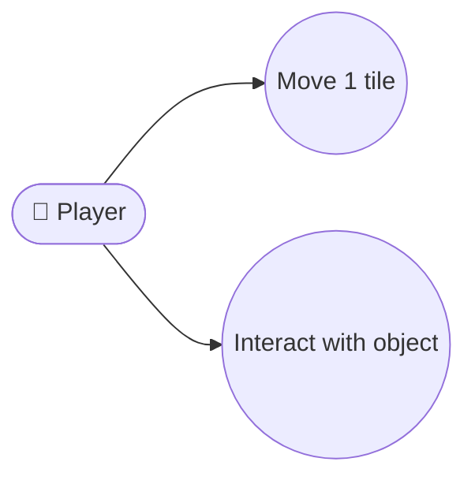

#### FR-002 楼层系统
- 游戏至少包含 10 层楼，每层 11×11 网格
- 楼层通过楼梯（上/下）连接，楼梯位置由关卡设计决定
- 部分楼梯需要特定道具（钥匙、宝石）或击败 BOSS 才能解锁
- 每层包含：怪物、道具、门、楼梯、NPC、隐藏房间等元素

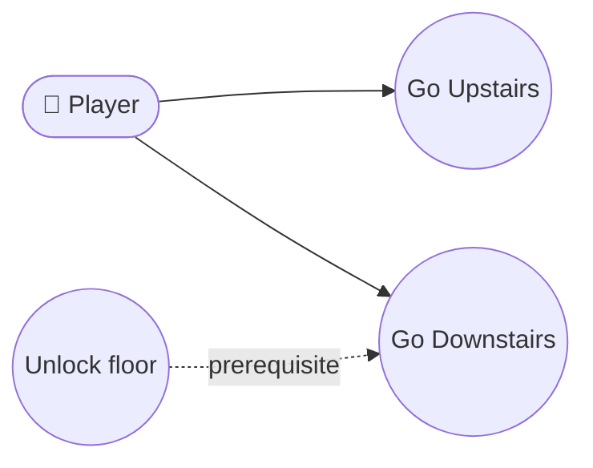

#### FR-003 战斗系统
- **触发条件**：玩家移动到与怪物相邻或进入同一格时触发战斗
- **伤害公式**（双方均适用）：
  ```
  伤害 = max(玩家ATK − 怪物DEF, 1)
  ```
  - 当玩家 ATK > 怪物 DEF 时，每回合造成差值伤害
  - 当玩家 ATK ≤ 怪物 DEF 时，每回合造成 1 点最低伤害（确保玩家始终能对怪物造成伤害）
  - 同理，怪物对玩家的伤害 = max(怪物ATK − 玩家DEF, 1)，最低为 1
  - 即：**无论攻防差值如何，每回合双方至少各造成 1 点伤害**
- **回合顺序**：玩家先攻（玩家先对怪物造成伤害，然后怪物对玩家造成伤害）
- **战斗结果**：
  - 玩家 HP > 0 且怪物 HP ≤ 0 → 玩家胜利，获得经验值 EXP 和金币
  - 怪物 HP > 0 且玩家 HP ≤ 0 → 玩家死亡，扣除金币后在上层入口复活
  - 玩家 HP ≤ 0 且怪物 HP ≤ 0（同回合击杀）→ 玩家死亡（同归于尽）
- **死亡复活**：玩家死亡后扣除 50 金币（若金币不足则扣为 0），在上一层入口重生，HP 恢复为初始值的 50%
- **战斗日志**：显示每回合伤害、总回合数、战斗结果

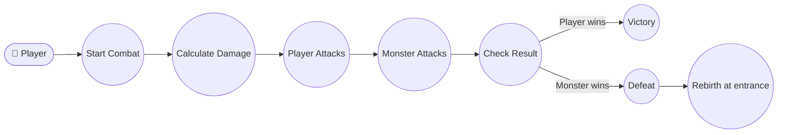

#### FR-004 升级系统
- 经验值 EXP 通过击败怪物获得
- **升级公式**（无等级上限，二次函数）：
  ```
  升级所需 EXP = 50 + (Lv × 30) + (Lv × Lv × 5)
  ```
  即：
  | 当前 Lv | 升至下一级所需 EXP | 累计总 EXP |
  | ------- | ------------------ | ---------- |
  | 1 → 2 | 85 | 85 |
  | 2 → 3 | 130 | 215 |
  | 3 → 4 | 185 | 400 |
  | 4 → 5 | 250 | 650 |
  | 5 → 6 | 325 | 975 |
  | 6 → 7 | 410 | 1385 |
  | 7 → 8 | 505 | 1890 |
  | 8 → 9 | 610 | 2500 |
  | 9 → 10 | 725 | 3225 |
  | 10 → 11 | 850 | 4075 |
- 升级后：HP +20，ATK +1，DEF +1
- 升级时自动生效，无需确认
- 升级信息在 HUD 中提示

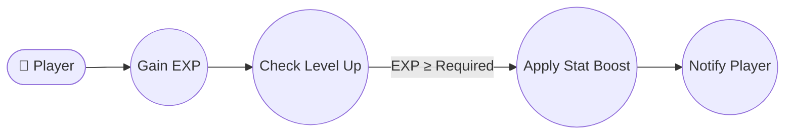

#### FR-005 道具系统
- **钥匙**：黄钥匙、蓝钥匙、红钥匙各 3 种颜色，用于打开对应颜色的门
- **血瓶**：红血瓶（恢复 50 HP）、蓝血瓶（恢复 100 HP）
- **宝石**：红宝石（ATK +1）、蓝宝石（DEF +1）
- **钥匙串**：同时拥有黄/蓝/红三把钥匙，可打开任意颜色的门
- 道具在背包中显示数量，点击使用或自动触发

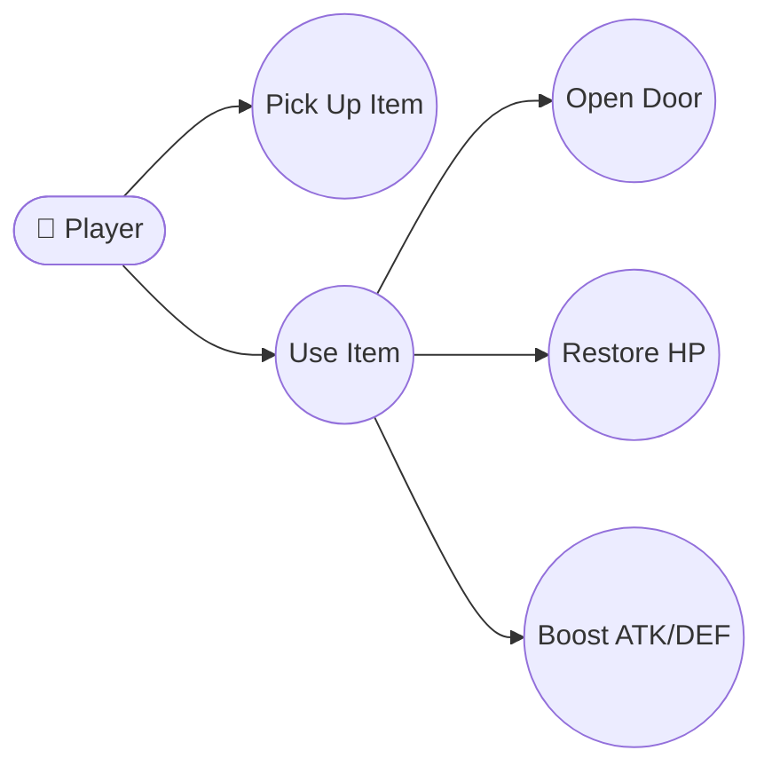

#### FR-006 BOSS 战
- **BOSS 配置**（至少 1 个，位于第 10 层）：
  | 属性 | 数值 |
  | ---- | ---- |
  | 名称 | 魔塔守护者 |
  | HP | 500 |
  | ATK | 30 |
  | DEF | 10 |
  | 掉落 | 钥匙串 + 红宝石 × 3 + 蓝宝石 × 3 |
- **BOSS 特殊机制**（多阶段战斗）：
  - **第一阶段**（HP > 250）：常规战斗，上述属性
  - **第二阶段**（HP ≤ 250）：BOSS 进入狂暴状态，ATK 提升至 40，DEF 提升至 15，每回合额外释放"恐惧"技能使玩家下回合 ATK 降低 2（持续 1 回合）
  - **阶段转换**：BOSS HP 降至 250 时立即触发，不消耗玩家回合
  - 阶段转换时显示剧情对话
- **通关奖励**：击败 BOSS 后解锁最终楼层，触发结局剧情
- **BOSS 战不可逃跑**，玩家必须击败 BOSS 才能继续

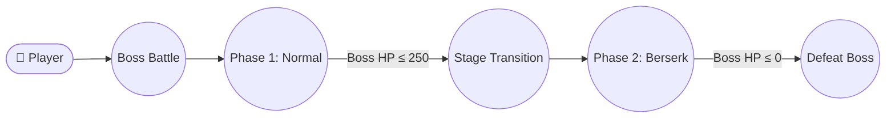

#### FR-007 NPC 与剧情
- 至少 1 个剧情 NPC，提供任务指引和背景故事
- NPC 对话支持多页滚动，包含剧情线索提示
- 剧情 NPC 可重复对话，对话内容根据玩家进度变化

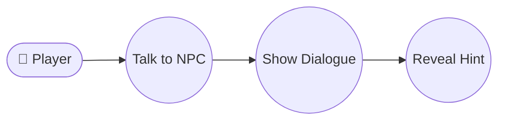

#### FR-008 商店系统
- 至少 1 个商店，位于第 5 层
- 商店提供：钥匙购买（各 5 金币）、血瓶购买（红血瓶 8 金币、蓝血瓶 15 金币）、宝石购买（红宝石 20 金币、蓝宝石 25 金币）、属性升级（消耗金币提升 ATK/DEF）
- 商店界面显示玩家当前金币和可购买商品列表

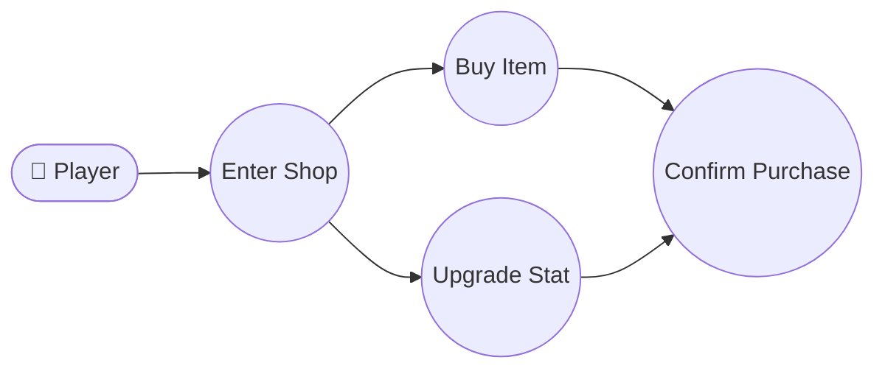

#### FR-009 隐藏房间
- 至少 1 个隐藏房间，包含稀有道具（如宝石、血瓶、钥匙）
- 隐藏房间通过特定路径（如连续走向同一方向 3 格后出现）或特定条件触发
- 隐藏房间入口以普通地板显示，踩中后显示隐藏房间

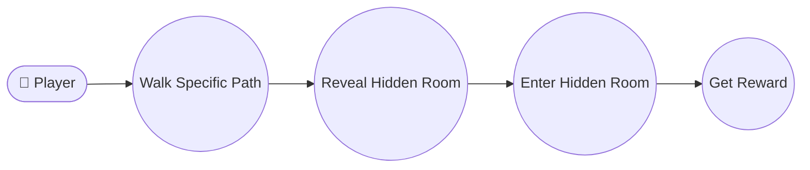

#### FR-010 内购占位
- 主菜单设置中提供"购买金币"按钮
- 点击后调用 mock IAP 接口，模拟成功/失败流程
- 内购成功后增加金币数量，弹窗通知

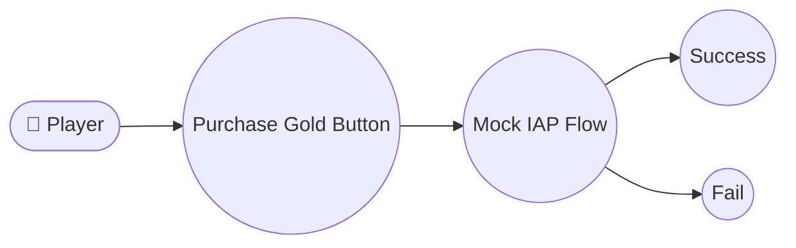

### 3.2 用户界面

#### FR-011 启动画面与主菜单
- 启动画面：显示游戏 Logo 和品牌名称，持续 2 秒
- 主菜单包含：开始游戏、继续游戏、设置、关于
- 主菜单背景为游戏场景缩略图或纯色背景

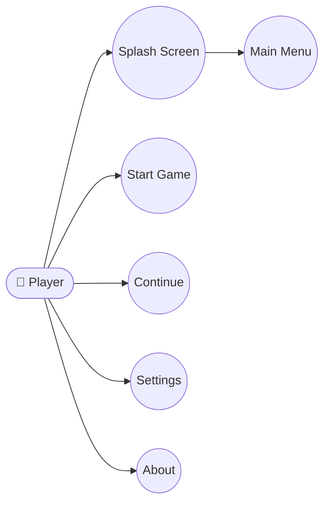

#### FR-012 HUD 显示
- 游戏内 HUD 显示：HP、ATK、DEF、Gold、EXP、Lv、当前楼层
- HUD 位于屏幕顶部，半透明背景
- 底部显示方向按钮（上/下/左/右）和攻击按钮

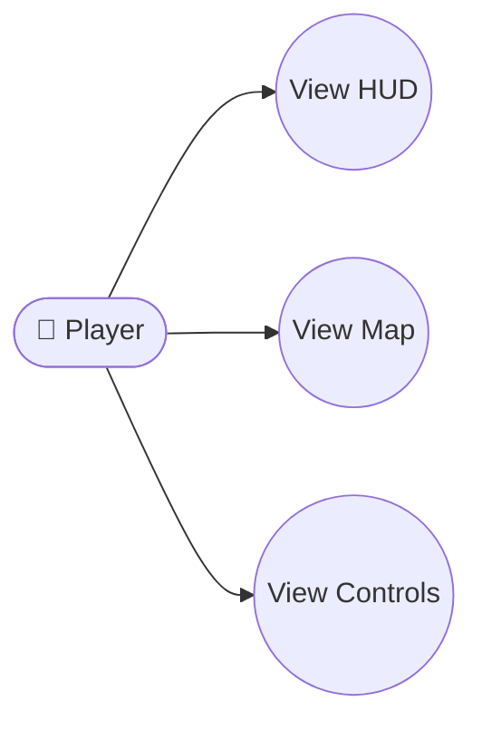

#### FR-013 操作按钮
- 底部方向键：上/下/左/右，用于控制玩家移动
- 攻击按钮：主动对相邻怪物发起攻击
- 道具栏按钮：打开道具选择界面

### 3.3 存档与设置

#### FR-014 自动存档
- 每次楼层切换时自动保存当前游戏状态
- 每次战斗结束时自动保存当前游戏状态
- 存档文件为 JSON 格式，包含玩家属性、道具、楼层进度、已探索信息

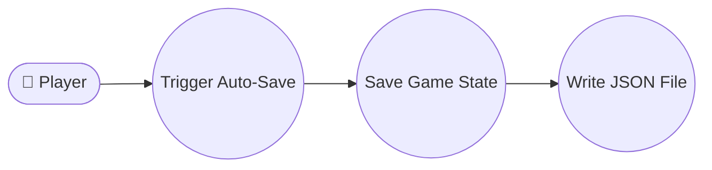

#### FR-015 手动存档
- 至少 3 个手动存档槽位
- 玩家可随时保存当前状态到指定槽位
- 存档界面显示每个槽位的楼层、时间戳、简要状态

#### FR-016 设置项
- BGM 音量调节（0-100%）
- SFX 音量调节（0-100%）
- 语言切换（中文/英文）
- 清除存档（需二次确认）

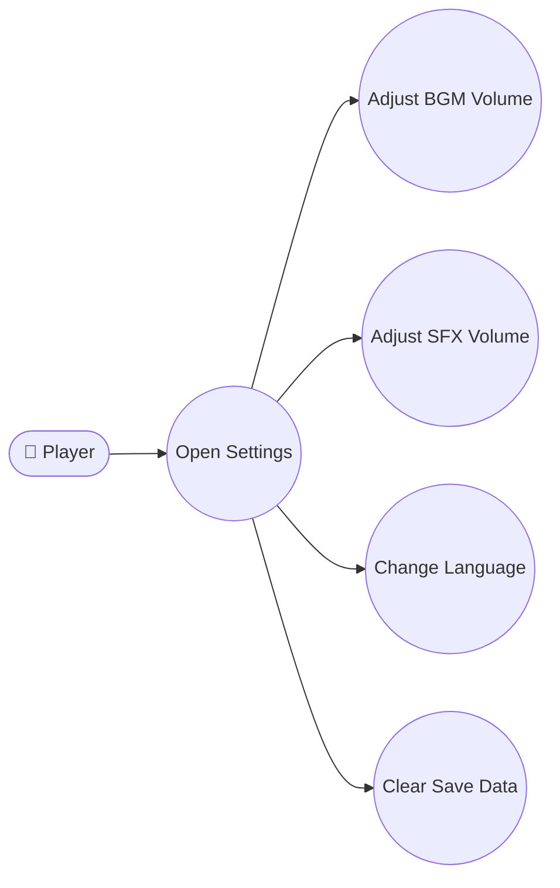

### 3.4 国际化

#### FR-017 双语支持
- 支持中文和英文两种语言
- 所有 UI 文字来自外置 i18n JSON 资源文件
- 语言切换后所有界面文字即时更新，无需重启

## 4 非功能需求

### NFR-001 性能

| 指标 | 目标值 | 测量方式 |
| ---- | ---- | ---- |
| 游戏运行帧率 | ≥ 60 FPS（稳定） | Flutter DevTools 帧率监控 |
| 冷启动时间 | < 3 秒 | 从点击图标到主菜单可操作计时 |
| 内存占用 | < 200 MB | Flutter DevTools Memory 面板 |
| 楼层切换加载 | < 0.5 秒 | 从楼梯点击到新地图渲染完成 |
| 战斗结算延迟 | < 0.2 秒 | 从战斗结束到可操作 |

### NFR-002 兼容性

- **Android**：最低 Android 8.0（API 26），支持所有主流屏幕尺寸和分辨率
- **iOS**：最低 iOS 13.0，支持 iPhone 和 iPad
- **屏幕方向**：推荐竖屏（Portrait），适配刘海屏和全面屏
- **字体缩放**：支持系统字体缩放设置

### NFR-003 可靠性

- 存档数据损坏恢复：自动检测存档完整性，损坏时提示重新选择
- 自动存档失败时不阻断游戏流程，记录错误日志
- 战斗计算精度：伤害计算使用整数运算，无浮点误差
- 崩溃后重启可恢复到最后一次自动存档状态

### NFR-004 可维护性

- 关卡数据与代码完全分离（JSON 数据驱动）
- 道具、怪物、NPC、剧情配置独立 JSON 文件
- 便于后续扩展新楼层、新道具、新怪物、新剧情
- 所有魔法数字和字符串常量外置为配置

### NFR-005 安全性

- 本地存档使用 AES-256 加密存储
- 内购 mock 流程不产生真实支付请求
- 不收集用户个人信息，无网络请求
- 存档文件存储于应用沙盒目录，不可被其他应用访问

### NFR-006 状态管理

- 使用 Riverpod 进行状态管理
- 所有游戏状态变更通过 Provider 触发，确保可预测、可测试
- 状态快照支持调试和回滚

### NFR-007 资源管理

- 使用纯色矩形 + Material Icons 作为占位资源
- 代码中预留 asset 槽位（`assets/images/`、`assets/audio/`）
- 资源加载使用 Flutter 的 AssetBundle，支持异步预加载

### NFR-008 测试覆盖

- 核心战斗公式、楼层切换、存档读写需有单元测试
- `scenarios/` 下有 e2e 集成测试覆盖至少 3 条主线
- 测试覆盖率目标：核心逻辑层 ≥ 80%

## 5 数据驱动格式定义（G-02）

### 5.1 楼层数据格式（`assets/floor_*.json`）

每张楼层对应一个 `floor_N.json` 文件（N 为楼层编号），结构如下：

```json
{
  "floor_id": 1,
  "name": "起始层",
  "width": 11,
  "height": 11,
  "grid": [
    [0, 0, 0, 0, 0, 0, 0, 0, 0, 0, 0],
    [0, 1, 1, 1, 1, 1, 1, 1, 1, 1, 0],
    [0, 1, 0, 0, 0, 0, 0, 0, 0, 1, 0],
    [0, 1, 0, 2, 0, 3, 0, 4, 0, 1, 0],
    [0, 1, 0, 0, 0, 0, 0, 0, 0, 1, 0],
    [0, 1, 1, 1, 1, 5, 1, 1, 1, 1, 0],
    [0, 1, 0, 0, 0, 0, 0, 0, 0, 1, 0],
    [0, 1, 0, 6, 0, 7, 0, 8, 0, 1, 0],
    [0, 1, 0, 0, 0, 0, 0, 0, 0, 1, 0],
    [0, 1, 1, 1, 1, 1, 1, 1, 1, 1, 0],
    [0, 0, 0, 0, 0, 0, 0, 0, 0, 0, 0]
  ],
  "entities": [
    {
      "id": "monster_01",
      "type": "monster",
      "monster_id": "slime",
      "position": [2, 3],
      "hp": 10,
      "atk": 3,
      "def": 0,
      "exp": 10,
      "gold": 5
    },
    {
      "id": "item_01",
      "type": "item",
      "item_id": "red_potion",
      "position": [3, 5],
      "quantity": 1
    },
    {
      "id": "npc_01",
      "type": "npc",
      "npc_id": "guide",
      "position": [6, 3],
      "dialogue_keys": ["npc_guide_intro", "npc_guide_hint1"]
    },
    {
      "id": "stair_down",
      "type": "stair",
      "direction": "down",
      "position": [5, 5],
      "unlock_condition": null
    },
    {
      "id": "stair_up",
      "type": "stair",
      "direction": "up",
      "position": [5, 9],
      "unlock_condition": null
    }
  ],
  "spawn_positions": {
    "player": [5, 9]
  },
  "unlock_requirements": {
    "stair_down": null,
    "stair_up": null
  }
}
```

**Tile 编码表**：

| 编码 | 含义 |
| ---- | ---- |
| 0 | 墙壁（不可通行） |
| 1 | 地板（可通行） |
| 2 | 黄门（需黄钥匙） |
| 3 | 蓝门（需蓝钥匙） |
| 4 | 红门（需红钥匙） |
| 5 | 下楼梯 |
| 6 | 上楼梯 |
| 7 | 隐藏地板（踩中触发隐藏房间） |
| 8 | 商店入口 |

**实体字段说明**：

| 字段 | 类型 | 说明 |
| ---- | ---- | ---- |
| `id` | string | 实体唯一标识 |
| `type` | string | 实体类型：`monster` / `item` / `npc` / `stair` / `boss` |
| `monster_id` | string | 怪物类型引用（对应 `monsters.json`） |
| `item_id` | string | 道具类型引用（对应 `items.json`） |
| `npc_id` | string | NPC 类型引用（对应 `npcs.json`） |
| `position` | [col, row] | 实体在 grid 中的坐标 |
| `hp` | int | 生命值（怪物/BOSS） |
| `atk` | int | 攻击力 |
| `def` | int | 防御力 |
| `exp` | int | 击杀获得的经验值 |
| `gold` | int | 击杀获得的金币 |
| `dialogue_keys` | string[] | NPC 对话文本的 i18n key 列表 |
| `unlock_condition` | object/null | 楼梯解锁条件：`{"requires": "key_red", "requires_boss": "boss_floor10"}` 或 null |

### 5.2 道具数据格式（`assets/items.json`）

```json
{
  "items": {
    "key_yellow": {"name_key": "item_key_yellow", "type": "key", "color": "yellow", "quantity": 3},
    "key_blue": {"name_key": "item_key_blue", "type": "key", "color": "blue", "quantity": 3},
    "key_red": {"name_key": "item_key_red", "type": "key", "color": "red", "quantity": 3},
    "key_bundle": {"name_key": "item_key_bundle", "type": "key_bundle", "color": "rainbow", "quantity": 0},
    "red_potion": {"name_key": "item_red_potion", "type": "potion", "color": "red", "heal": 50, "quantity": 0},
    "blue_potion": {"name_key": "item_blue_potion", "type": "potion", "color": "blue", "heal": 100, "quantity": 0},
    "ruby": {"name_key": "item_ruby", "type": "gem", "color": "red", "atk_bonus": 1, "quantity": 0},
    "sapphire": {"name_key": "item_sapphire", "type": "gem", "color": "blue", "def_bonus": 1, "quantity": 0}
  }
}
```

### 5.3 怪物数据格式（`assets/monsters.json`）

```json
{
  "monsters": {
    "slime": {"name_key": "monster_slime", "hp": 10, "atk": 3, "def": 0, "exp": 10, "gold": 5, "color": "green"},
    "rat": {"name_key": "monster_rat", "hp": 20, "atk": 5, "def": 1, "exp": 20, "gold": 10, "color": "brown"},
    "skeleton": {"name_key": "monster_skeleton", "hp": 50, "atk": 10, "def": 3, "exp": 50, "gold": 25, "color": "white"},
    "knight": {"name_key": "monster_knight", "hp": 100, "atk": 20, "def": 8, "exp": 100, "gold": 50, "color": "gray"},
    "boss_guardian": {"name_key": "monster_boss_guardian", "hp": 500, "atk": 30, "def": 10, "exp": 500, "gold": 200, "color": "purple", "is_boss": true, "phases": [{"hp_threshold": 250, "atk": 40, "def": 15, "special": "fear"}]}
  }
}
```

### 5.4 NPC 数据格式（`assets/npcs.json`）

```json
{
  "npcs": {
    "guide": {
      "name_key": "npc_guide",
      "dialogues": [
        {"page": 1, "keys": ["npc_guide_intro", "npc_guide_hint1"]},
        {"page": 2, "keys": ["npc_guide_hint2", "npc_guide_hint3"], "condition": {"floor": ">=5"}}
      ]
    }
  }
}
```

### 5.5 国际化数据格式（`assets/i18n.json`）

```json
{
  "locales": ["zh-CN", "en-US"],
  "data": {
    "zh-CN": {
      "menu": {"start": "开始游戏", "continue": "继续游戏", "settings": "设置", "about": "关于"},
      "hud": {"hp": "生命值", "atk": "攻击力", "def": "防御力", "gold": "金币", "exp": "经验", "lv": "等级", "floor": "楼层"},
      "combat": {"victory": "胜利！", "defeat": "你死了...", "rebirth": "复活中...", "turn": "回合", "damage": "伤害"},
      "items": {"key_yellow": "黄钥匙", "key_blue": "蓝钥匙", "key_red": "红钥匙", "red_potion": "红血瓶", "blue_potion": "蓝血瓶", "ruby": "红宝石", "sapphire": "蓝宝石"},
      "monsters": {"slime": "史莱姆", "rat": "老鼠", "skeleton": "骷髅兵", "knight": "骑士", "boss_guardian": "魔塔守护者"},
      "settings": {"bgm_volume": "背景音乐音量", "sfx_volume": "音效音量", "language": "语言", "clear_save": "清除存档", "confirm_clear": "确定清除所有存档？"},
      "shop": {"title": "商店", "buy": "购买", "not_enough_gold": "金币不足", "upgrade_atk": "提升攻击力", "upgrade_def": "提升防御力"}
    },
    "en-US": {
      "menu": {"start": "Start Game", "continue": "Continue", "settings": "Settings", "about": "About"},
      "hud": {"hp": "HP", "atk": "ATK", "def": "DEF", "gold": "Gold", "exp": "EXP", "lv": "Lv", "floor": "Floor"},
      "combat": {"victory": "Victory!", "defeat": "You died...", "rebirth": "Rebirthing...", "turn": "Turn", "damage": "Damage"},
      "items": {"key_yellow": "Yellow Key", "key_blue": "Blue Key", "key_red": "Red Key", "red_potion": "Red Potion", "blue_potion": "Blue Potion", "ruby": "Ruby", "sapphire": "Sapphire"},
      "monsters": {"slime": "Slime", "rat": "Rat", "skeleton": "Skeleton", "knight": "Knight", "boss_guardian": "Tower Guardian"},
      "settings": {"bgm_volume": "BGM Volume", "sfx_volume": "SFX Volume", "language": "Language", "clear_save": "Clear Save Data", "confirm_clear": "Clear all save data?"},
      "shop": {"title": "Shop", "buy": "Buy", "not_enough_gold": "Not enough gold", "upgrade_atk": "Upgrade ATK", "upgrade_def": "Upgrade DEF"}
    }
  }
}
```

## 6 用例

### UC-001 新游戏开始

| 项目 | 内容 |
| ---- | ---- |
| 参与者 | 玩家 |
| 前置条件 | 玩家已启动游戏并到达主菜单 |
| 主要流程 | 1. 玩家点击"开始游戏"按钮<br>2. 系统创建新游戏状态（Lv1、初始属性）<br>3. 加载第 1 层地图<br>4. 进入游戏界面 |
| 覆盖需求 | FR-011, FR-001 |

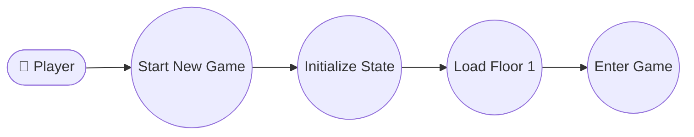

### UC-002 继续游戏

| 项目 | 内容 |
| ---- | ---- |
| 参与者 | 玩家 |
| 前置条件 | 存在未过期的存档 |
| 主要流程 | 1. 玩家点击"继续游戏"按钮<br>2. 系统列出所有存档槽位<br>3. 玩家选择存档槽位<br>4. 系统加载存档状态<br>5. 进入游戏界面 |
| 覆盖需求 | FR-014, FR-015 |

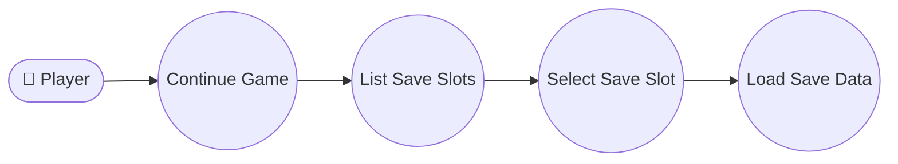

### UC-003 战斗与升级

| 项目 | 内容 |
| ---- | ---- |
| 参与者 | 玩家 |
| 前置条件 | 玩家与怪物相邻 |
| 主要流程 | 1. 玩家移动到怪物相邻格或点击攻击<br>2. 系统进入战斗界面<br>3. 自动计算回合制伤害<br>4. 显示每回合战斗日志<br>5. 战斗结束后结算 EXP 和金币<br>6. 若 EXP 满足升级条件，自动升级 |
| 覆盖需求 | FR-003, FR-004 |

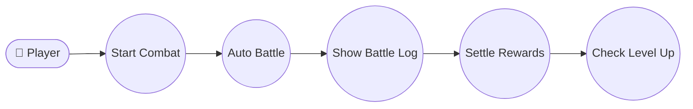

### UC-004 楼层探索与道具收集

| 项目 | 内容 |
| ---- | ---- |
| 参与者 | 玩家 |
| 前置条件 | 玩家已在游戏界面 |
| 主要流程 | 1. 玩家移动探索楼层<br>2. 踩到道具自动拾取<br>3. 使用钥匙打开对应颜色门<br>4. 使用道具恢复 HP 或提升属性<br>5. 找到楼梯切换到其他楼层 |
| 覆盖需求 | FR-001, FR-002, FR-005 |

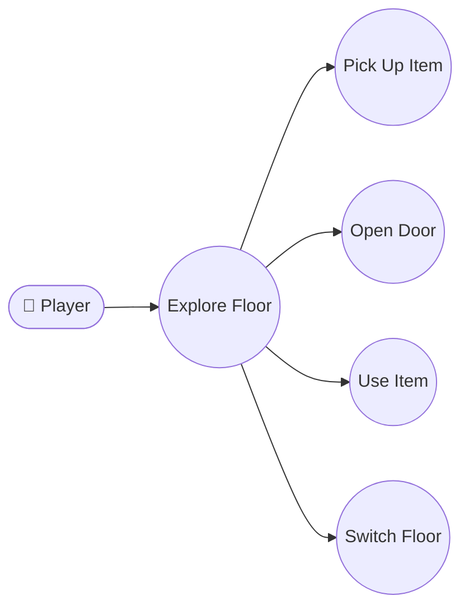

### UC-005 BOSS 战

| 项目 | 内容 |
| ---- | ---- |
| 参与者 | 玩家 |
| 前置条件 | 玩家到达第 10 层并找到 BOSS |
| 主要流程 | 1. 玩家与 BOSS 接触触发 BOSS 战<br>2. 进入 BOSS 战斗界面<br>3. BOSS 第一阶段常规战斗<br>4. BOSS HP 降至 250 时进入第二阶段<br>5. 显示阶段转换剧情<br>6. 第二阶段 BOSS 属性提升并释放技能<br>7. 击败 BOSS 后结算通关奖励<br>8. 触发结局剧情 |
| 覆盖需求 | FR-003, FR-006 |

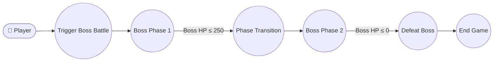

### UC-006 商店购物

| 项目 | 内容 |
| ---- | ---- |
| 参与者 | 玩家 |
| 前置条件 | 玩家到达第 5 层并进入商店 |
| 主要流程 | 1. 玩家与商店 NPC 接触<br>2. 显示商店商品列表<br>3. 玩家选择商品并确认购买<br>4. 系统检查金币是否足够<br>5. 扣除金币，增加对应道具<br>6. 显示购买成功提示 |
| 覆盖需求 | FR-008 |

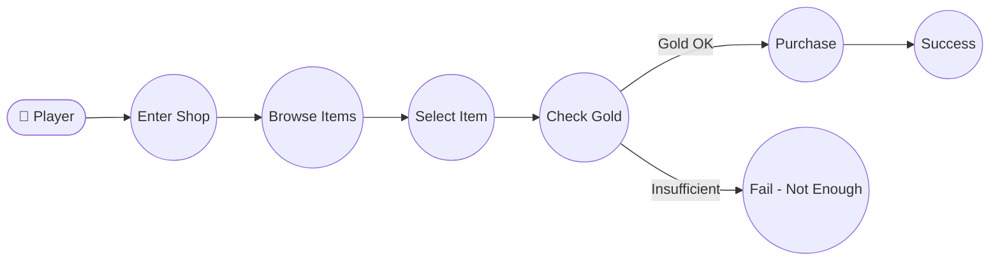

### UC-007 存档管理

| 项目 | 内容 |
| ---- | ---- |
| 参与者 | 玩家 |
| 前置条件 | 游戏进行中 |
| 主要流程 | 1. 玩家打开存档菜单<br>2. 选择保存或读取操作<br>3. 保存：将当前状态写入 JSON 文件<br>4. 读取：从 JSON 文件加载状态<br>5. 系统验证存档完整性后恢复游戏 |
| 覆盖需求 | FR-014, FR-015 |

```mermaid
flowchart LR
  actor_player(["👤 Player"])
  uc_open_save_menu(("Open Save Menu"))
  uc_select_action(("Select Save/Load"))
  uc_save_to_slot(("Save to Slot"))
  uc_load_from_slot(("Load from Slot"))
  uc_validate_save(("Validate Save"))
  uc_restore_game(("Restore Game"))
  actor_player --> uc_open_save_menu
  uc_open_save_menu --> uc_select_action
  uc_select_action --> uc_save_to_slot
  uc_select_action --> uc_load_from_slot
  uc_load_from_slot --> uc_validate_save
  uc_validate_save --> uc_restore_game
```

### UC-008 发现隐藏房间

| 项目 | 内容 |
| ---- | ---- |
| 参与者 | 玩家 |
| 前置条件 | 玩家位于隐藏房间附近 |
| 主要流程 | 1. 玩家踩到隐藏地板 tile<br>2. 隐藏房间显现<br>3. 玩家进入房间获得奖励 |
| 覆盖需求 | FR-009 |

```mermaid
flowchart LR
  actor_player(["👤 Player"])
  uc_step_hidden(("Step on Hidden Tile"))
  uc_reveal_room(("Reveal Hidden Room"))
  uc_enter_room(("Enter Room"))
  uc_collect_reward(("Collect Reward"))
  actor_player --> uc_step_hidden
  uc_step_hidden --> uc_reveal_room
  uc_reveal_room --> uc_enter_room
  uc_enter_room --> uc_collect_reward
```
