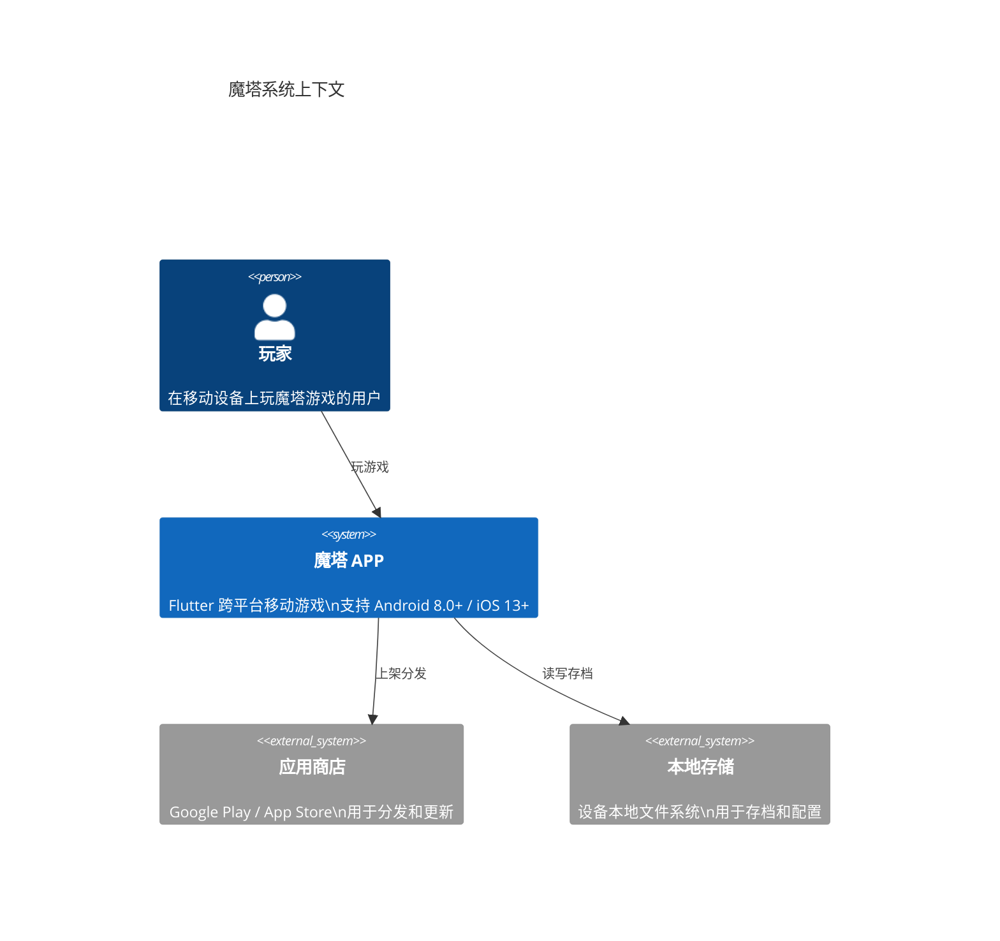
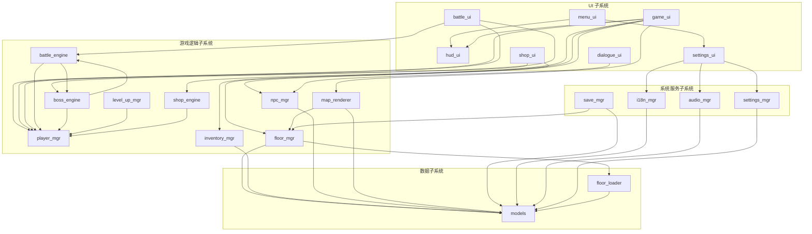
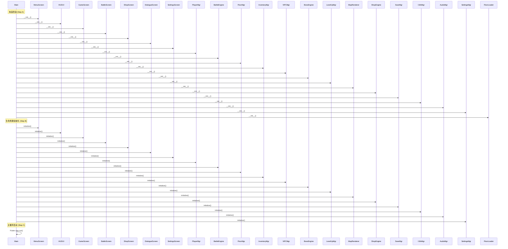
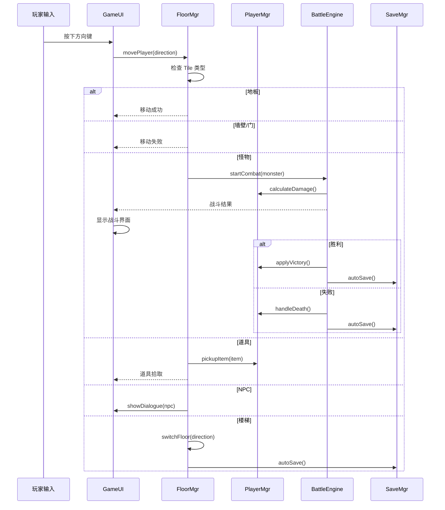
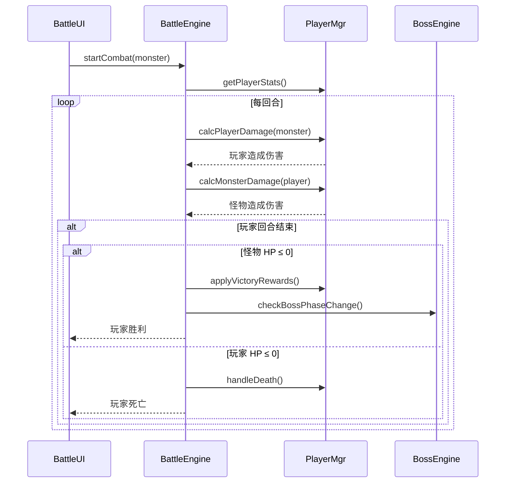
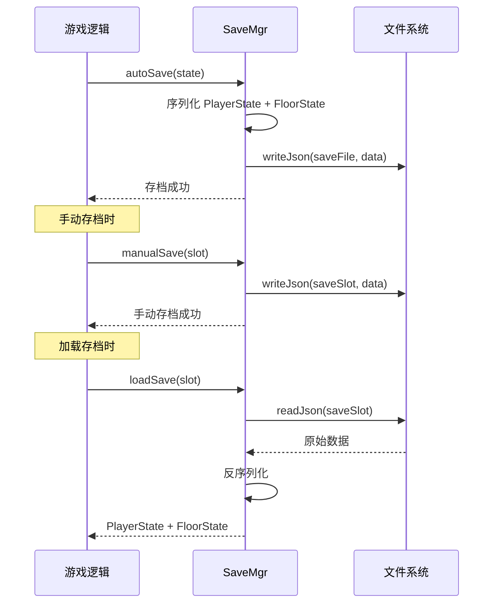
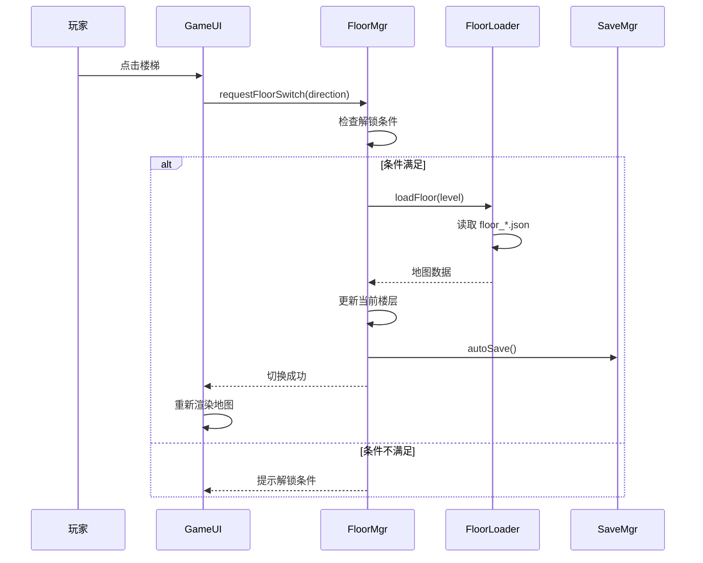
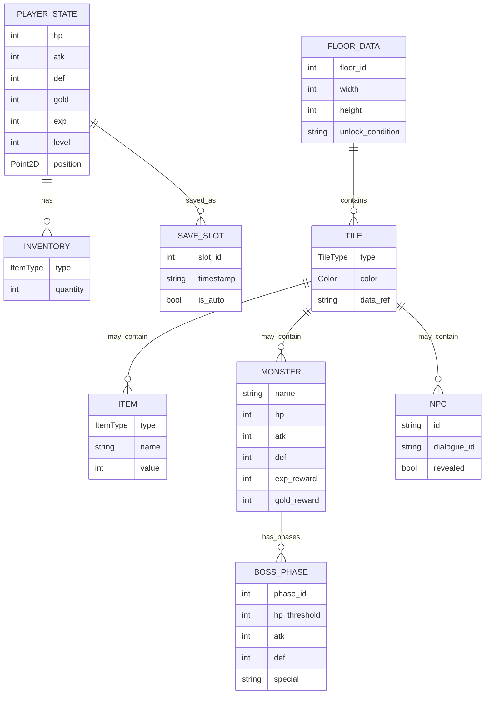
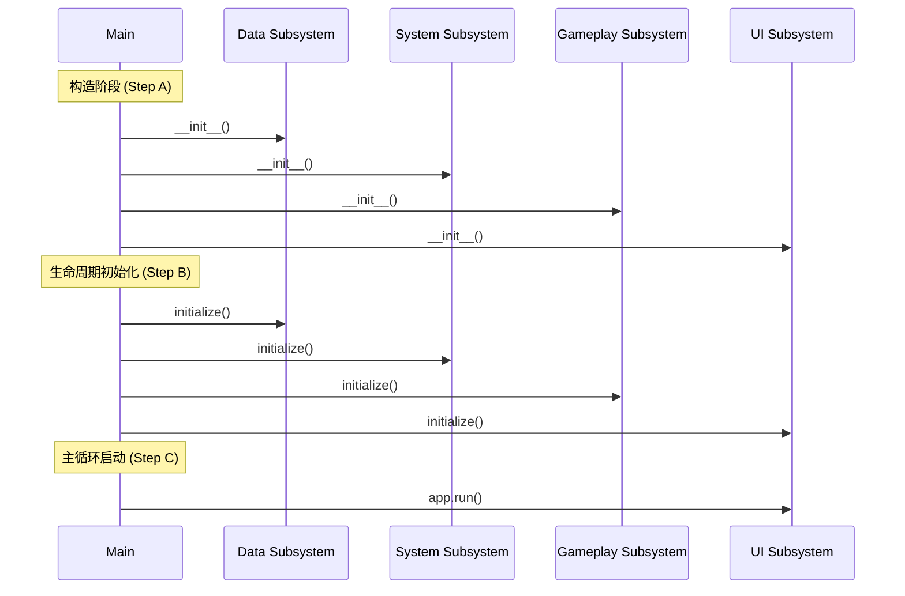

# 魔塔 (Magic Tower) — 架构设计文档

## 1 概述

本架构文档描述了一款商用级魔塔（Magic Tower）手机游戏 APP 的系统架构。游戏采用经典回合制 RPG 玩法，基于 Flutter 3.x + Dart 跨平台开发，支持 Android 8.0+ 与 iOS 13+。系统划分为四个子系统：UI 子系统、游戏逻辑子系统、系统服务子系统和数据子系统。



## 2 技术栈选型

| 层面 | 技术选型 | 理由 |
|------|---------|------|
| 跨平台框架 | Flutter 3.x | 单一代码库同时编译 Android 和 iOS，性能接近原生 |
| 编程语言 | Dart | 类型安全、AOT 编译性能好，与 Flutter 深度集成 |
| 状态管理 | Riverpod | 编译时安全、测试友好、社区推荐 |
| 持久化 | path_provider + JSON 序列化 | 轻量级本地文件存储，无需数据库依赖 |
| 国际化 | flutter_localizations + 自定义 i18n | Flutter 原生支持，配合 JSON 资源文件 |
| 音频 | flutter_audio_player (占位) | BGM/SFX 播放占位实现 |
| 内购 | in_app_purchase (占位) | Flutter 官方内购插件接口，mock 实现 |

## 3 子系统架构

```mermaid
C4Container
  title 魔塔容器架构
  Container(game_app, "魔塔游戏应用", "Flutter App", "包含所有游戏 UI、逻辑、系统和数据子系统")
  
  Container_Boundary(ui_boundary, "UI 子系统", "所有用户界面和交互") {
    Component(menu_ui, "主菜单界面", "启动画面 + 主菜单\n开始/继续/设置/关于")
    Component(hud_ui, "HUD 组件", "游戏内 HUD\n显示四维+楼层+操作按钮")
    Component(game_ui, "游戏主界面", "地图渲染 + 玩家移动\n操作按钮 + 事件处理")
    Component(battle_ui, "战斗界面", "回合制战斗动画\n伤害计算展示")
    Component(shop_ui, "商店界面", "道具购买界面\n金币扣除逻辑")
    Component(dialogue_ui, "对话界面", "NPC 剧情对话\n多页滚动显示")
    Component(settings_ui, "设置界面", "音量/语言/清除存档")
  }
  
  Container_Boundary(gameplay_boundary, "游戏逻辑子系统", "核心玩法和规则引擎") {
    Component(player_mgr, "玩家管理器", "HP/ATK/DEF/Gold/EXP/Lv\n升级逻辑")
    Component(battle_engine, "战斗引擎", "回合制伤害计算\n战斗流程控制")
    Component(floor_mgr, "楼层管理器", "11×11 地图管理\n楼层切换逻辑")
    Component(inventory_mgr, "背包管理器", "道具拾取/使用\n钥匙/血瓶/宝石")
    Component(npc_mgr, "NPC 管理器", "剧情对话管理\n线索提示")
    Component(boss_engine, "BOSS 引擎", "多阶段 BOSS 战斗\n阶段转换逻辑")
    Component(level_up_mgr, "升级管理器", "EXP 升级公式\n属性提升")
    Component(map_renderer, "地图渲染器", "Tile 渲染逻辑\n颜色占位")
    Component(shop_engine, "商店引擎", "商品列表管理\n购买流程")
  }
  
  Container_Boundary(system_boundary, "系统服务子系统", "跨切面服务") {
    Component(save_mgr, "存档管理器", "自动存档/手动存档\nJSON 文件读写")
    Component(i18n_mgr, "国际化管理器", "中英文切换\ni18n JSON 加载")
    Component(audio_mgr, "音频管理器", "BGM/SFX 音量控制\n播放占位")
    Component(settings_mgr, "设置管理器", "设置持久化\n配置管理")
  }
  
  Container_Boundary(data_boundary, "数据子系统", "数据模型和加载") {
    Component(models, "数据模型", "PlayerState/Item/Floor等\n核心数据结构")
    Component(floor_loader, "楼层数据加载器", "floor_*.json 解析\n地图数据驱动")
  }
  
  Rel(game_app, ui_boundary, "使用")
  Rel(game_app, gameplay_boundary, "使用")
  Rel(game_app, system_boundary, "使用")
  Rel(game_app, data_boundary, "使用")
  
  Rel(ui_boundary, gameplay_boundary, "触发事件")
  Rel(gameplay_boundary, system_boundary, "请求服务")
  Rel(gameplay_boundary, data_boundary, "读取数据")
  Rel(system_boundary, data_boundary, "持久化数据")
```

## 4 模块依赖关系图



## 5 组件交互流程

### 5.1 启动与初始化流程



### 5.2 游戏主循环流程



### 5.3 战斗流程



### 5.4 存档流程



### 5.5 楼层切换流程



## 6 数据模型



## 7 子系统详细设计

### 7.1 UI 子系统 (ui)

| 组件 | 文件 | 职责 |
|------|------|------|
| MenuUI | `lib/ui/menu_screen.dart` | 启动画面 + 主菜单（开始/继续/设置/关于） |
| HUDWidget | `lib/ui/hud_ui.dart` | 游戏内 HUD：显示四维+楼层+操作按钮 |
| GameUI | `lib/ui/game_screen.dart` | 游戏主界面：地图渲染 + 玩家移动 + 事件处理 |
| BattleUI | `lib/ui/battle_screen.dart` | 战斗界面：回合制战斗动画 + 伤害展示 |
| ShopUI | `lib/ui/shop_screen.dart` | 商店界面：道具购买 + 金币扣除 |
| DialogueUI | `lib/ui/dialogue_screen.dart` | NPC 对话界面：多页滚动剧情显示 |
| SettingsUI | `lib/ui/settings_screen.dart` | 设置界面：音量/语言/清除存档 |

### 7.2 游戏逻辑子系统 (gameplay)

| 组件 | 文件 | 职责 |
|------|------|------|
| PlayerMgr | `lib/gameplay/player_mgr.dart` | 玩家状态管理：HP/ATK/DEF/Gold/EXP/Lv |
| BattleEngine | `lib/gameplay/battle_engine.dart` | 回合制伤害计算：max(ATK−DEF, 1) |
| FloorMgr | `lib/gameplay/floor_mgr.dart` | 11×11 地图管理 + 楼层切换逻辑 |
| InventoryMgr | `lib/gameplay/inventory_mgr.dart` | 道具拾取/使用：钥匙/血瓶/宝石 |
| NPCMgr | `lib/gameplay/npc_mgr.dart` | 剧情对话管理 + 线索提示 |
| BossEngine | `lib/gameplay/boss_engine.dart` | 多阶段 BOSS 战斗逻辑 |
| LevelUpMgr | `lib/gameplay/level_up_mgr.dart` | EXP 升级公式：50+Lv×30+Lv²×5 |
| MapRenderer | `lib/gameplay/map_renderer.dart` | Tile 渲染逻辑 + 颜色占位 |
| ShopEngine | `lib/gameplay/shop_engine.dart` | 商店商品管理 + 购买流程 |

### 7.3 系统服务子系统 (system)

| 组件 | 文件 | 职责 |
|------|------|------|
| SaveMgr | `lib/system/save_mgr.dart` | 自动存档/手动存档：JSON 文件读写 |
| I18nMgr | `lib/system/i18n_mgr.dart` | 中英文切换：i18n JSON 资源加载 |
| AudioMgr | `lib/system/audio_mgr.dart` | BGM/SFX 音量控制：播放占位 |
| SettingsMgr | `lib/system/settings_mgr.dart` | 设置持久化：配置管理 |

### 7.4 数据子系统 (data)

| 组件 | 文件 | 职责 |
|------|------|------|
| Models | `lib/data/models.dart` | 核心数据结构：PlayerState/Item/Floor 等 |
| FloorLoader | `lib/data/floor_loader.dart` | floor_*.json 解析：地图数据驱动 |

## 8 关键设计决策

### 8.1 为什么选择 Riverpod

Riverpod 提供编译时安全的状态管理，比 Provider 更简洁。对于魔塔这种状态更新频繁的游戏，Riverpod 的 `Notifier` 模式可以 cleanly 管理玩家状态、楼层状态和 UI 状态的变化。

### 8.2 数据驱动地图

所有楼层数据通过 `floor_*.json` 文件驱动，而非硬编码。这使得：
- 关卡设计可以独立于代码迭代
- 新增楼层只需添加 JSON 文件
- 测试时可以用 mock JSON 数据

### 8.3 占位资源策略

使用纯颜色矩形 + Material Icons 作为美术占位，但代码中预留 asset 槽位：
- `assets/images/` — 角色、怪物、道具精灵图
- `assets/audio/` — BGM 和 SFX 文件
- `assets/data/` — floor_*.json 和 i18n.json

### 8.4 存档策略

- **自动存档**：楼层切换后、战斗结束后自动触发
- **手动存档**：3 个独立槽位，支持保存/读取/删除
- **文件格式**：JSON，使用 `path_provider` 获取应用文档目录

### 8.5 内购占位

使用 `in_app_purchase` 插件接口，但实现为 mock 版本：
- 点击按钮弹出确认弹窗
- 模拟支付成功/取消
- 成功后增加金币，失败不阻塞游戏

## 9 性能优化策略

- **60 FPS 保证**：使用 Flutter 的 `RepaintBoundary` 隔离 HUD 重绘区域
- **冷启动优化**：预加载 i18n 资源和第一层地图数据
- **内存管理**：楼层切换时释放上一地图数据，保持内存 < 200MB
- **渲染优化**：地图 Tile 使用批量绘制，避免逐格渲染

## 10 测试策略

### 单元测试
- 战斗公式测试：验证 max(ATK−DEF, 1) 公式在各种攻防组合下的正确性
- 升级公式测试：验证 EXP 升级公式在不同等级下的正确性
- 存档读写测试：验证 JSON 序列化/反序列化的正确性
- 道具使用测试：验证钥匙开门、血瓶回血等逻辑

### E2E 集成测试 (scenarios/)
- 主线流程：开局→上 2 楼→死亡复活
- 商店购买：进入商店→购买道具→金币扣除验证
- BOSS 战：进入 BOSS 层→多阶段战斗→击败 BOSS

## 11 启动序列


