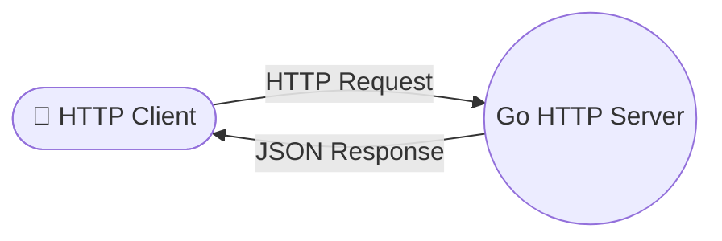
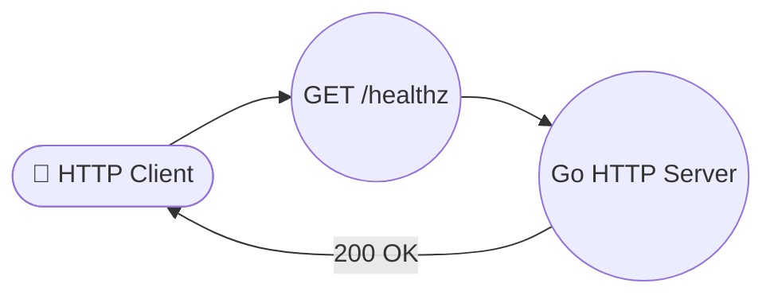
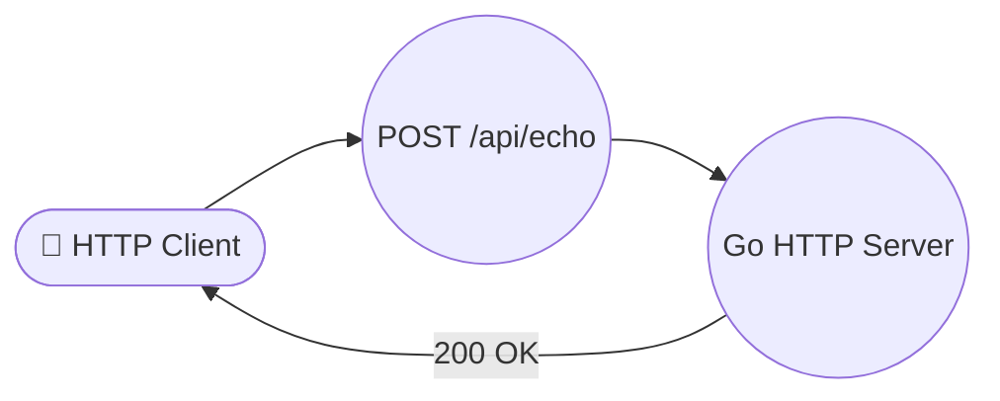
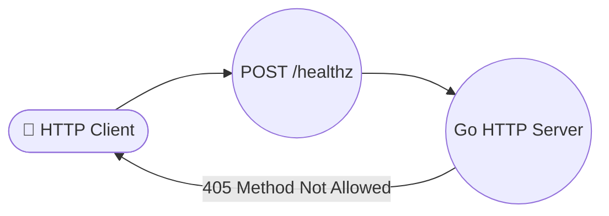
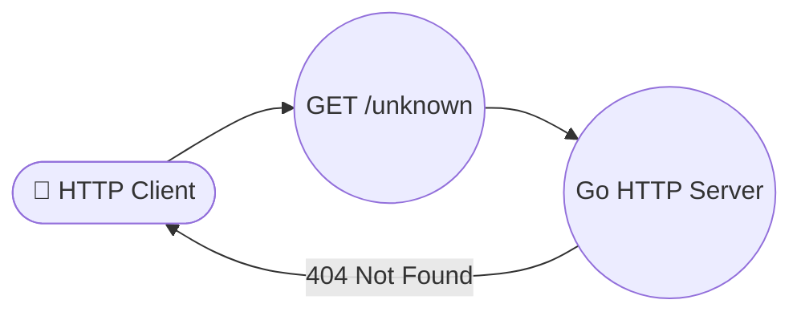
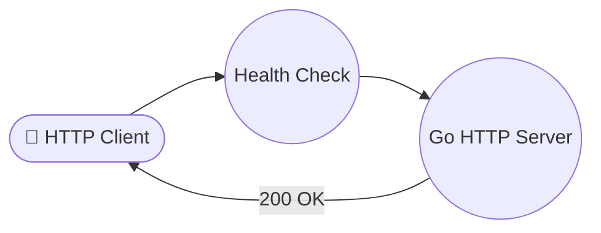
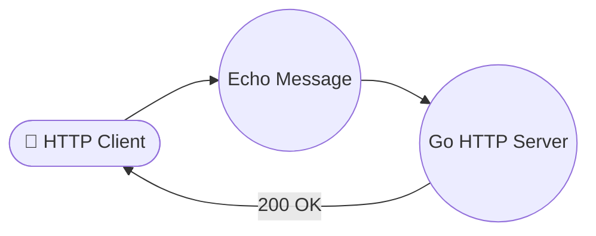
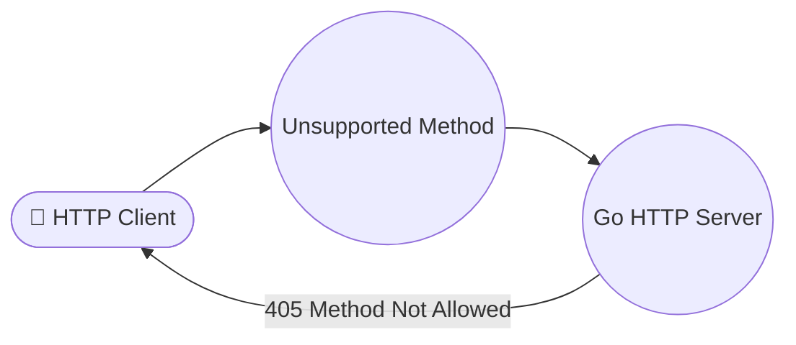
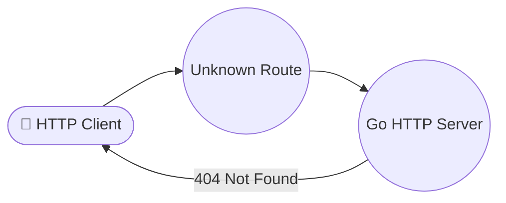
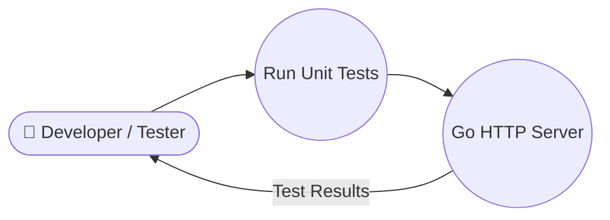

# Go HTTP Server — Requirement Specification

## 1. Executive Summary

This document specifies the functional and non-functional requirements for a single-binary Go HTTP server built using only the standard library (`net/http`, `encoding/json`, `testing`). The server exposes two HTTP endpoints: a health-check probe and an echo service that returns the echoed message along with its byte length. No database, no third-party dependencies, and no external services are required.

## 2. Functional Requirements

### FR-001: Health Check Endpoint

The server MUST expose a `GET /healthz` endpoint that returns a JSON body `{"status":"ok"}` with HTTP status code 200 and `Content-Type: application/json`.

**Acceptance Criteria:**

- The server listens on port `8080` by default.
- A `GET /healthz` request returns HTTP 200 with body exactly `{"status":"ok"}` (no trailing newline).
- The response header `Content-Type` is `application/json`.
- The endpoint responds within 100 ms under normal conditions.

### FR-002: Echo Endpoint

The server MUST expose a `POST /api/echo` endpoint that accepts a JSON body containing a `message` field of type string, and returns a JSON body with the echoed message and its length.

**Acceptance Criteria:**

- The request body MUST be valid JSON with a `"message"` key whose value is a string.
- If the request body is missing, malformed, or `"message"` is absent, the server returns HTTP 400 with `{"error":"invalid input"}`.
- If the `"message"` value is not a string type, the server returns HTTP 400 with `{"error":"invalid input"}`.
- On success, the server returns HTTP 200 with body `{"echo":"<message>","length":<int>}` where `<message>` is the original string and `<int>` is the byte length of the string.
- The response header `Content-Type` is `application/json`.

### FR-003: Unsupported Methods

The server MUST reject unsupported HTTP methods on known endpoints with HTTP 405 (Method Not Allowed).

**Acceptance Criteria:**

- `POST /healthz` returns 405.
- `GET /api/echo` returns 405.

### FR-004: Unknown Routes

The server MUST return HTTP 404 (Not Found) for any path that is not a registered endpoint.

**Acceptance Criteria:**

- Any request to an unregistered path returns 404 with `{"error":"not found"}`.

### FR-005: Unit Tests

The project MUST include unit tests using Go's standard `testing` package that cover all functional requirements:

**Acceptance Criteria:**

- Health check endpoint returns correct status code and body.
- Echo endpoint with valid input returns correct echo and length.
- Echo endpoint with missing message field returns 400.
- Echo endpoint with malformed JSON returns 400.
- Echo endpoint with non-string message value returns 400.
- Unsupported method returns 405.
- Unknown route returns 404.

## 3. Non-Functional Requirements

### NFR-001: Performance

The server MUST handle at least 100 concurrent requests on a single core without exceeding 500 ms response latency (p95). The server MUST start within 2 seconds of execution.

### NFR-002: Resource Constraints

The server MUST NOT allocate more than 32 MB of memory under normal operation. The server MUST NOT depend on any third-party Go modules — only the standard library is allowed.

### NFR-003: Input Validation

The maximum accepted message length is 10 000 bytes. Messages exceeding this limit return HTTP 400 with `{"error":"message too long"}`.

### NFR-004: Content-Type Enforcement

All responses MUST include the `Content-Type: application/json` header.

### NFR-005: Error Response Format

All error responses MUST follow the JSON structure `{"error":"<reason>"}` with an appropriate HTTP status code.

### NFR-006: Deterministic Output

The health check endpoint MUST always return the identical response body `{"status":"ok"}` with no randomness or timestamps.

## 4. Use Cases

### UC-001: Health Check

| Field        | Value                                                        |
| ------------ | ------------------------------------------------------------ |
| **Actor**    | HTTP Client                                                  |
| **Goal**     | Verify that the server is running and healthy.               |
| **Preconditions** | The server is started and listening on port 8080.        |
| **Main Flow** | 1. Client sends `GET /healthz`. 2. Server returns `200 OK` with `{"status":"ok"}`. 3. Client parses the response and confirms health. |
| **Postconditions** | Server continues to serve requests normally.           |
| **Covers**   | FR-001, NFR-001, NFR-004, NFR-006                            |

### UC-002: Echo Message

| Field        | Value                                                        |
| ------------ | ------------------------------------------------------------ |
| **Actor**    | HTTP Client                                                  |
| **Goal**     | Send a message to the server and receive it back with its length. |
| **Preconditions** | The server is started and listening on port 8080.        |
| **Main Flow** | 1. Client sends `POST /api/echo` with JSON body `{"message":"hello"}`. 2. Server validates the input. 3. Server returns `200 OK` with `{"echo":"hello","length":5}`. 4. Client parses and processes the response. |
| **Alternate Flow** | If the message is missing or malformed, the server returns `400 Bad Request`. If the message exceeds 10 000 bytes, the server returns `400 Bad Request` with `{"error":"message too long"}`. |
| **Postconditions** | Server continues to serve requests normally.           |
| **Covers**   | FR-002, NFR-001, NFR-003, NFR-004                           |

### UC-003: Unsupported Method Handling

| Field        | Value                                                        |
| ------------ | ------------------------------------------------------------ |
| **Actor**    | HTTP Client                                                  |
| **Goal**     | Attempt an unsupported HTTP method and receive a 405 response. |
| **Preconditions** | The server is started and listening on port 8080.        |
| **Main Flow** | 1. Client sends `POST /healthz` or `GET /api/echo`. 2. Server rejects the request with `405 Method Not Allowed`. |
| **Postconditions** | No state is changed on the server.                         |
| **Covers**   | FR-003, NFR-005                                              |

### UC-004: Unknown Route Handling

| Field        | Value                                                        |
| ------------ | ------------------------------------------------------------ |
| **Actor**    | HTTP Client                                                  |
| **Goal**     | Access an unregistered path and receive a 404 response.      |
| **Preconditions** | The server is started and listening on port 8080.        |
| **Main Flow** | 1. Client sends `GET /unknown` or any other unregistered path. 2. Server returns `404 Not Found` with `{"error":"not found"}`. |
| **Postconditions** | No state is changed on the server.                         |
| **Covers**   | FR-004, NFR-005                                              |

### UC-005: Run Unit Tests

| Field        | Value                                                        |
| ------------ | ------------------------------------------------------------ |
| **Actor**    | Developer / Tester                                           |
| **Goal**     | Execute all unit tests using Go's standard `testing` package and verify they pass. |
| **Preconditions** | The server code is written and `go.mod` is initialized.  |
| **Main Flow** | 1. Developer runs `go test ./...`. 2. All test cases execute against the in-memory server or handlers. 3. All tests pass with zero failures. |
| **Postconditions** | Codebase is verified to meet all acceptance criteria.  |
| **Covers**   | FR-005                                                         |

## 5. Constraints

- The server MUST be a single binary compiled from Go source code.
- No third-party dependencies are permitted — only the Go standard library.
- No database, no external service calls, no configuration files required at runtime.
- The server listens on port 8080 by default.
- The project MUST use Go modules (`go.mod`) for dependency management.

## 6. Glossary

| Term           | Definition                                                   |
| -------------- | ------------------------------------------------------------ |
| **Byte length** | The number of bytes in a UTF-8 encoded string, as returned by `len([]byte(s))` in Go. |
| **Echo**       | The original message string returned verbatim in the response. |
| **Health check** | A lightweight endpoint used to verify server availability. |
| **Method Not Allowed** | HTTP 405 status code indicating the HTTP method is not supported for the target path. |
| **Not Found**  | HTTP 404 status code indicating the requested path does not exist. |
