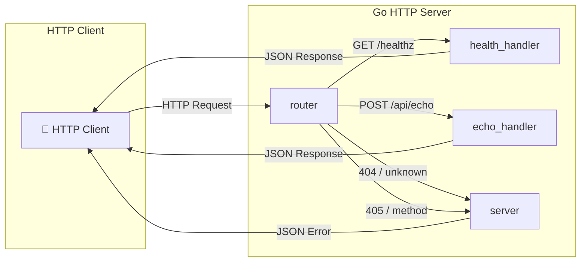
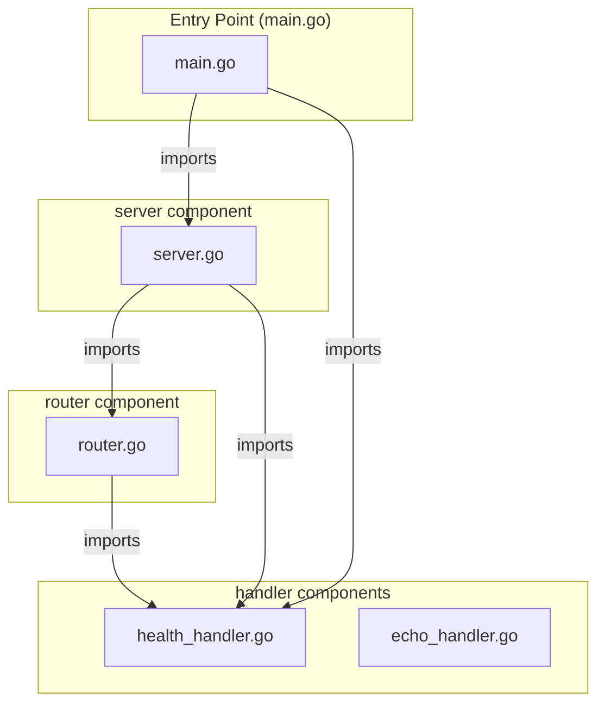
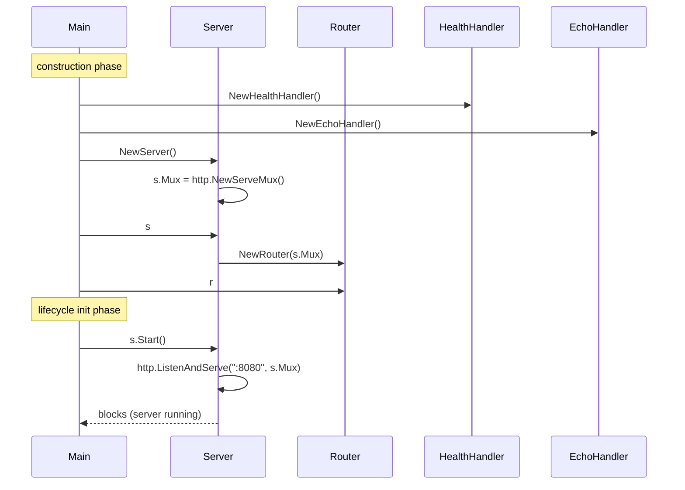
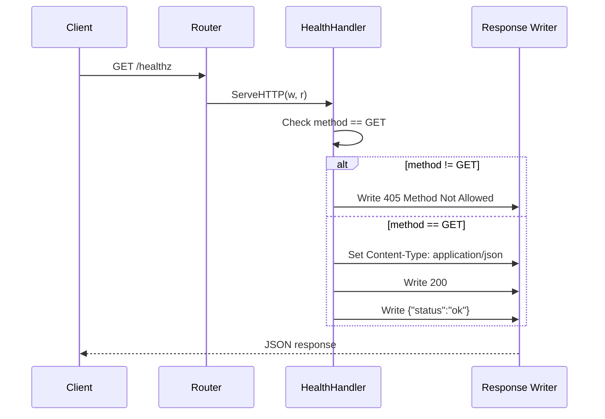
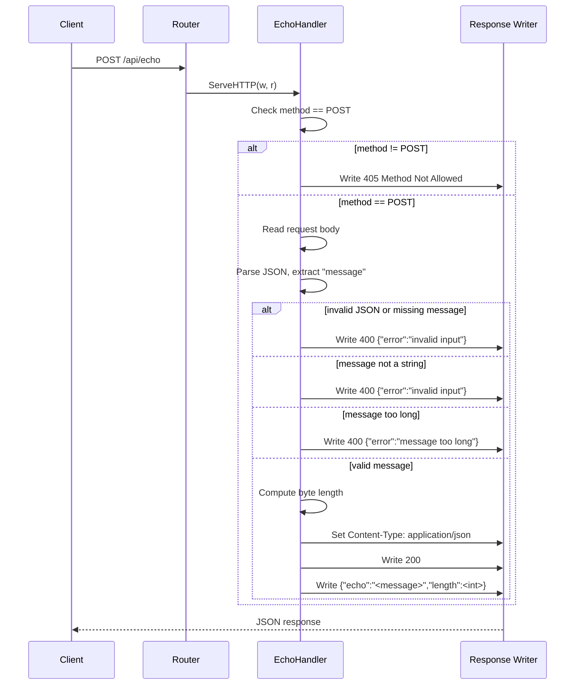
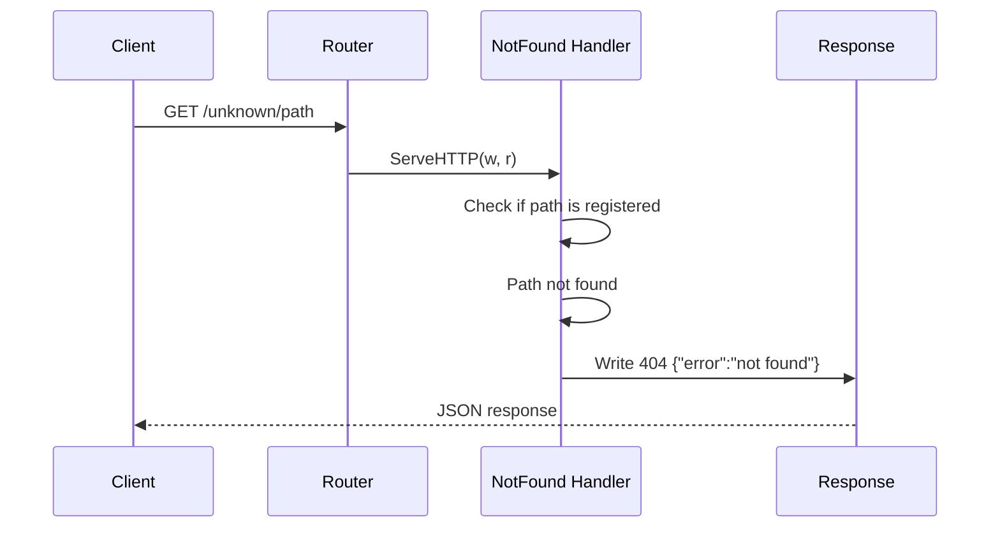
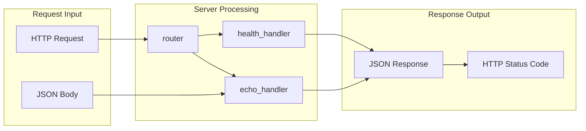
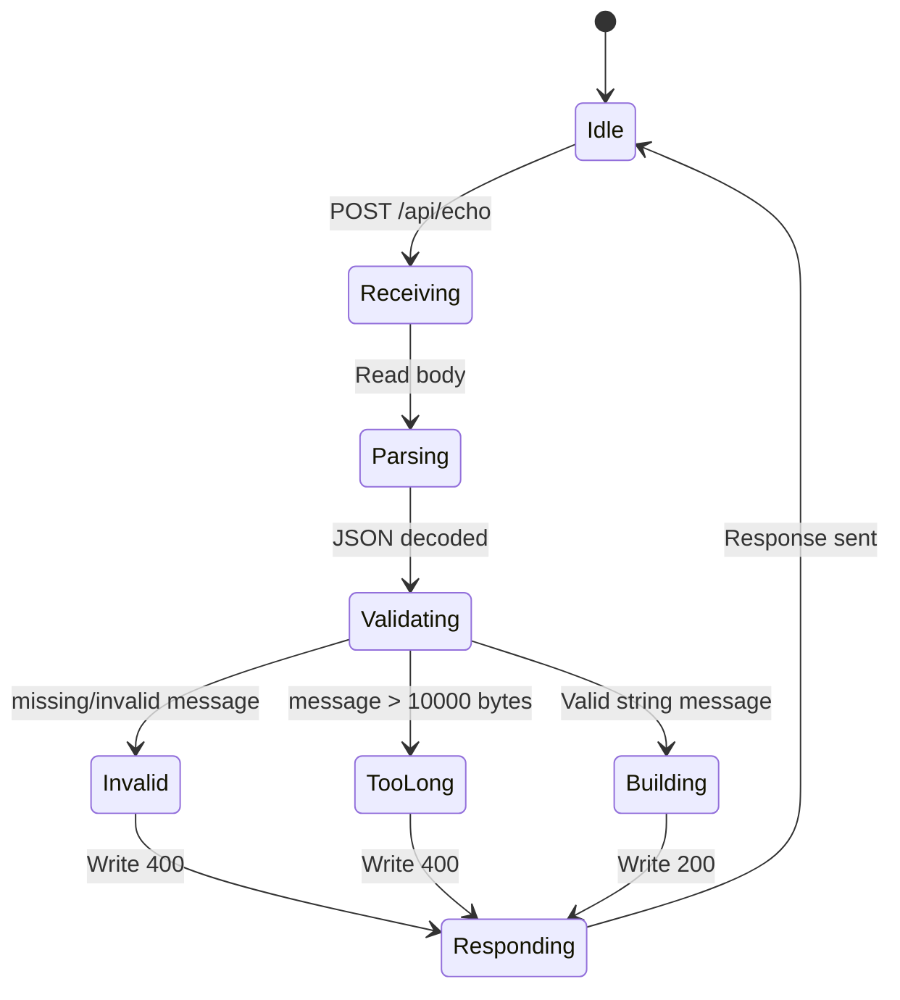

# Go HTTP Server — Architecture Design Document

## 1. Executive Summary

This document defines the architecture for a single-binary Go HTTP server built exclusively with the Go standard library. The server exposes two HTTP endpoints — a health-check probe (`GET /healthz`) and an echo service (`POST /api/echo`) — and listens on port 8080. No database, no third-party dependencies, and no external services are required.



## 2. Technology Stack

| Aspect | Choice | Justification |
|--------|--------|---------------|
| Language | Go 1.22+ | Strong standard library, built-in HTTP server, native compilation |
| Runtime | Go runtime (native) | Single-binary deployment, no VM overhead |
| HTTP Framework | `net/http` (stdlib) | Zero dependencies, battle-tested, sufficient for two endpoints |
| JSON Handling | `encoding/json` (stdlib) | Standard library serialization/deserialization |
| Testing | `testing` (stdlib) | Built-in testing framework, no external test runner needed |
| Package Manager | Go modules (`go.mod`) | Built-in dependency management, no external tooling |

**Why no framework?** The requirement is strictly two HTTP endpoints with JSON I/O. `net/http` provides everything needed — muxing, middleware, and response writing — without adding the complexity of a third-party framework. This keeps the binary small and the attack surface minimal.

## 3. Module Decomposition

The system consists of a single deployable unit — the Go HTTP server binary — with four internal components:

### 3.1. `server` (Server Bootstrap)

**Responsibility:** Creates the `http.Server`, configures the listen address, and starts the HTTP listener.

**Public API:**

```go
// Server encapsulates the HTTP server configuration and lifecycle.
type Server struct {
    Addr     string           // Listen address, default ":8080"
    Server   *http.Server     // Underlying http.Server instance
    Mux      *http.ServeMux   // Request router
}

// NewServer creates a new Server with default configuration.
func NewServer() *Server

// SetupRoutes registers all route handlers on the server's router.
func (s *Server) SetupRoutes()

// Start begins listening on the configured address. Blocks until the server stops.
func (s *Server) Start() error

// Shutdown gracefully shuts down the server, waiting for in-flight requests.
func (s *Server) Shutdown(ctx context.Context) error
```

### 3.2. `router` (Request Router)

**Responsibility:** Registers route handlers with the `http.ServeMux` and enforces method restrictions.

**Public API:**

```go
// Router manages route registration and method validation.
type Router struct {
    Mux *http.ServeMux
}

// NewRouter creates a new Router backed by the given ServeMux.
func NewRouter(mux *http.ServeMux) *Router

// RegisterHealthz registers the health check handler for GET /healthz.
func (r *Router) RegisterHealthz(h http.HandlerFunc)

// RegisterEcho registers the echo handler for POST /api/echo.
func (r *Router) RegisterEcho(h http.HandlerFunc)

// RegisterNotFound sets up the default 404 handler.
func (r *Router) RegisterNotFound(h http.HandlerFunc)
```

### 3.3. `health_handler` (Health Check)

**Responsibility:** Handles `GET /healthz` requests and returns `{"status":"ok"}`.

**Public API:**

```go
// HealthHandler handles GET /healthz requests.
type HealthHandler struct{}

// NewHealthHandler creates a new HealthHandler.
func NewHealthHandler() *HealthHandler

// ServeHTTP implements http.Handler for the health check endpoint.
// Returns HTTP 200 with body {"status":"ok"} and Content-Type application/json.
func (h *HealthHandler) ServeHTTP(w http.ResponseWriter, r *http.Request)
```

### 3.4. `echo_handler` (Echo Service)

**Responsibility:** Handles `POST /api/echo` requests. Parses the JSON body, validates the `message` field, and returns the echoed message with its byte length.

**Public API:**

```go
// EchoHandler handles POST /api/echo requests.
type EchoHandler struct {
    MaxMessageLength int // Maximum allowed message length in bytes, default 10000
}

// NewEchoHandler creates a new EchoHandler with default configuration.
func NewEchoHandler() *EchoHandler

// ServeHTTP implements http.Handler for the echo endpoint.
// Accepts POST with JSON body {"message":"string"}, returns {"echo":"<message>","length":<int>}.
// Returns 400 for invalid input, 405 for wrong method.
func (h *EchoHandler) ServeHTTP(w http.ResponseWriter, r *http.Request)
```

### 3.5. Data Models / Schemas

**Health Check Response:**
```json
{
  "status": "ok"
}
```
- `status` (string, required): Always `"ok"`.

**Echo Request:**
```json
{
  "message": "string"
}
```
- `message` (string, required): The message to echo. Max 10,000 bytes.

**Echo Response:**
```json
{
  "echo": "string",
  "length": 0
}
```
- `echo` (string, required): The original message.
- `length` (integer, required): The byte length of the message.

**Error Response:**
```json
{
  "error": "string"
}
```
- `error` (string, required): Error description. Values: `"invalid input"`, `"message too long"`, `"not found"`.

### 3.6. Module Dependency Graph



**Dependency rules:**
- `main.go` imports `server`, `health_handler`, `echo_handler`
- `server.go` imports `router`, `health_handler`, `echo_handler`
- `router.go` imports `health_handler`, `echo_handler`
- `health_handler.go` and `echo_handler.go` have no internal imports (only stdlib)

## 4. Component Interaction Flows

### 4.1. Boot Sequence



### 4.2. Health Check Request Flow



### 4.3. Echo Request Flow



### 4.4. Unknown Route Flow



### 4.5. Data Flow Diagram



### 4.6. Echo Handler State Machine



## 5. Lifecycle Init Contract

The `Server` component has a second-phase lifecycle method `Start()` that is called after all components are constructed. This is the critical lifecycle init that transitions the server from idle to accepting connections.

**lifecycle_inits:**

| attr | method | class | module |
|------|--------|-------|--------|
| server | Start | Server | internal/server/server.go |

The entry point (`cmd/server/main.go`) calls `server.Start()` after construction and route registration. This method blocks until the server is shut down, serving as the main event loop for the application.

## 6. Non-Functional Design Decisions

1. **Single binary, no framework:** The requirement for zero third-party dependencies and a single-binary deployment makes the standard library the only viable choice. `net/http` is sufficient for two endpoints.

2. **`http.ServeMux` for routing:** Go's built-in router handles path matching and method checking natively. No need for a third-party mux.

3. **Struct-based handlers:** Each handler is a struct (not a plain function) to allow configuration (e.g., `MaxMessageLength` on `EchoHandler`) while keeping the API clean.

4. **Error responses follow a consistent JSON schema:** All errors use `{"error":"<reason>"}` format, making client error handling predictable.

5. **No persistence layer:** The server is stateless. All requests are independent. No need for connection pools, caches, or databases.

## 7. Technology Stack Summary

| Aspect | Value |
|--------|-------|
| Language | Go |
| Runtime | Go native |
| Framework | `net/http` (stdlib) |
| JSON | `encoding/json` (stdlib) |
| Testing | `testing` (stdlib) |
| Package Manager | Go modules (`go.mod`) |
| Port | 8080 |
| Third-party deps | None |
