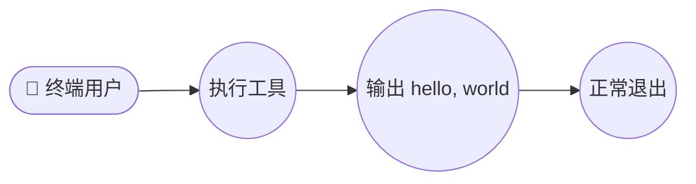
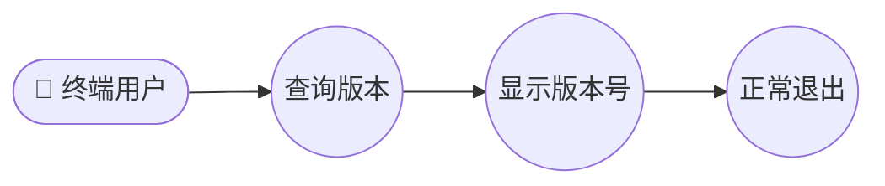
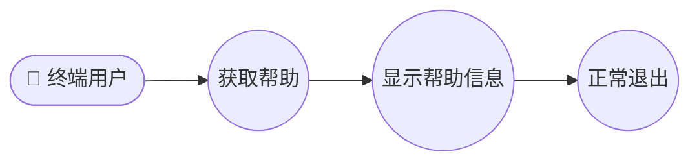

# 需求规格说明书

## 概述

本项目构建一个 Python 命令行工具（CLI），在运行时向标准输出打印 "hello, world" 字符串。该工具旨在提供简洁、可靠的文本输出功能，适用于学习、演示或作为更复杂 CLI 工具的起点。

## 功能需求

### FR-001: 打印标准问候语

系统必须支持通过命令行执行，并在标准输出上打印 "hello, world" 字符串。

- 执行命令后，工具应立即将 "hello, world" 输出到 stdout
- 输出内容必须精确匹配 "hello, world"（区分大小写）
- 输出后应附加一个换行符（`\n`）
- 退出状态码必须为 0（成功）

### FR-002: 版本信息

系统必须支持通过命令行参数查询工具的版本信息。

- 执行 `--version` 或 `-V` 参数时，工具应输出版本号
- 版本号格式应符合语义化版本规范（如 `0.1.0`）
- 版本信息应输出到 stdout 后正常退出
- 退出状态码必须为 0

### FR-003: 帮助信息

系统必须支持通过命令行参数获取帮助信息。

- 执行 `--help` 或 `-h` 参数时，工具应显示使用说明
- 帮助信息应包含：工具描述、可用参数、使用示例
- 帮助信息应输出到 stdout
- 退出状态码必须为 0

### FR-004: 无参数默认行为

系统必须在无任何命令行参数时，执行默认行为（打印 "hello, world"）。

- 直接运行工具（不带任何参数）应等同于执行默认打印操作
- 输出内容与带默认行为时一致
- 退出状态码必须为 0

## 非功能需求

### NFR-001: 执行效率

系统应在 1 秒内完成执行并输出结果。

- 从进程启动到输出完成的总时间应小于 1 秒
- 对于简单打印操作，实际执行时间应远小于 100 毫秒
- 内存占用应低于 10 MB

### NFR-002: 兼容性

系统应兼容 Python 3.7 及以上版本。

- 代码应使用 Python 3.7+ 语法和标准库
- 不应依赖任何第三方库
- 应能在主流操作系统上运行（Linux、macOS、Windows）

### NFR-003: 可靠性

系统应始终正确输出预期内容。

- 每次执行都应输出 "hello, world"（或对应参数版本）
- 不应出现运行时错误、异常或未定义行为
- 输出编码应为 UTF-8

### NFR-004: 可维护性

系统代码应保持简洁、可读。

- 源代码文件不超过 100 行（不含注释和空行）
- 代码结构应清晰，遵循 PEP 8 编码规范
- 应包含必要的注释说明

## 用例

### UC-001: 执行默认问候

| 属性 | 描述 |
|------|------|
| 参与者 | 终端用户 |
| 目标 | 运行工具并获取 "hello, world" 输出 |
| 前置条件 | 系统已安装 Python 3.7+，工具已部署 |
| 主要流程 | 1. 用户在终端中执行工具命令 2. 工具启动并执行默认逻辑 3. 工具向 stdout 输出 "hello, world" 4. 工具正常退出，返回状态码 0 |
| 覆盖需求 | FR-001, FR-004 |

### UC-002: 查询版本信息

| 属性 | 描述 |
|------|------|
| 参与者 | 终端用户 |
| 目标 | 获取工具的版本号信息 |
| 前置条件 | 系统已安装 Python 3.7+，工具已部署 |
| 主要流程 | 1. 用户在终端中执行工具并添加 `--version` 参数 2. 工具解析参数并识别版本请求 3. 工具向 stdout 输出版本号 4. 工具正常退出，返回状态码 0 |
| 覆盖需求 | FR-002 |

### UC-003: 获取帮助信息

| 属性 | 描述 |
|------|------|
| 参与者 | 终端用户 |
| 目标 | 查看工具的使用说明和参数信息 |
| 前置条件 | 系统已安装 Python 3.7+，工具已部署 |
| 主要流程 | 1. 用户在终端中执行工具并添加 `--help` 参数 2. 工具解析参数并识别帮助请求 3. 工具向 stdout 输出帮助信息 4. 工具正常退出，返回状态码 0 |
| 覆盖需求 | FR-003 |

## 约束

### C-001: 技术约束

- 必须使用 Python 语言开发
- 仅使用 Python 标准库，不依赖第三方包
- 代码必须兼容 Python 3.7 及以上版本

### C-002: 输出约束

- 默认输出必须严格为 "hello, world"（不含额外引号或前缀）
- 输出应包含末尾换行符
- 编码必须为 UTF-8

### C-003: 项目结构约束

- 源代码存放于 `src/` 目录
- 测试代码存放于 `tests/` 目录
- 文档存放于 `docs/` 目录
