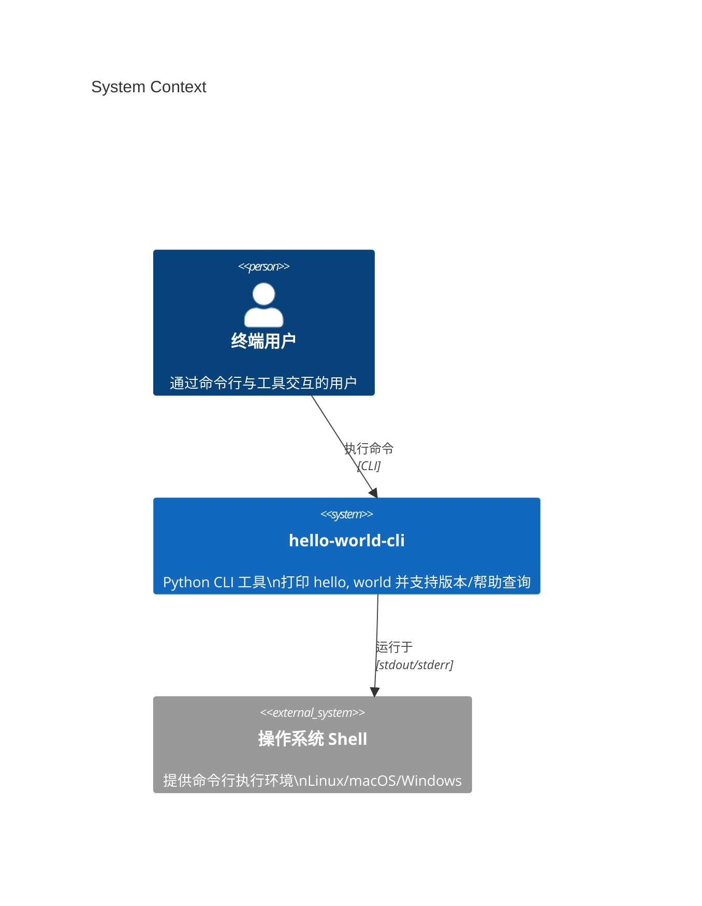
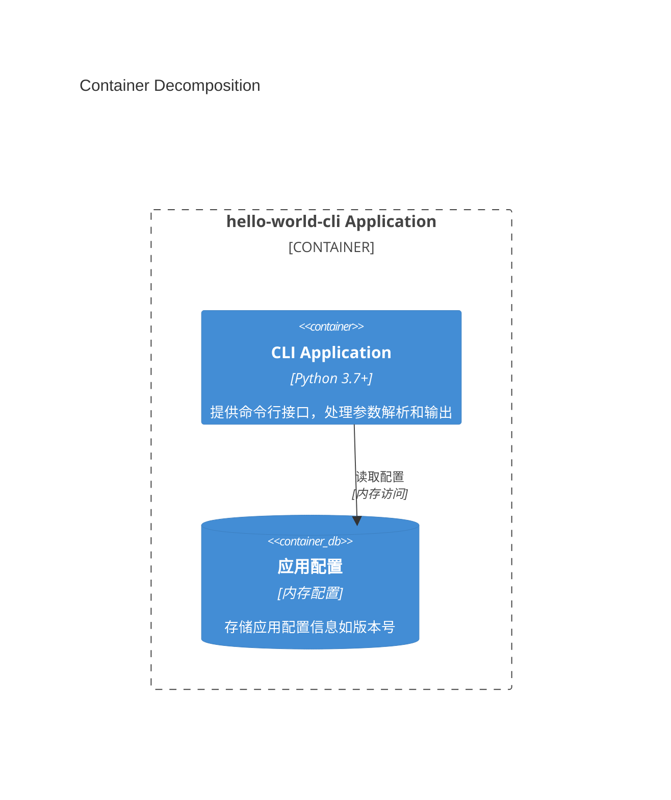
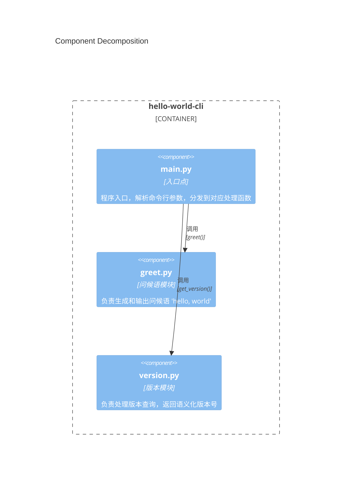
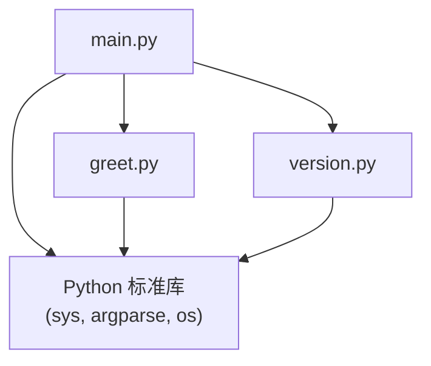
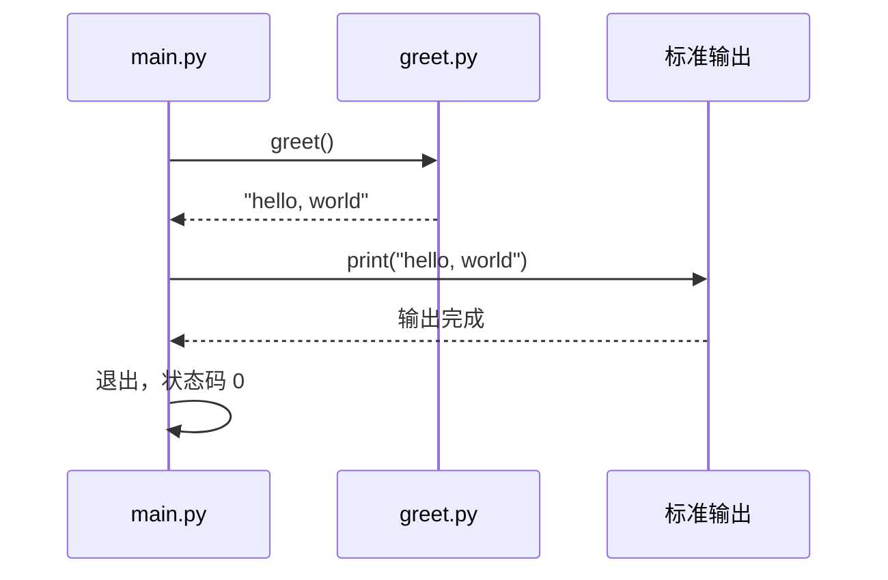
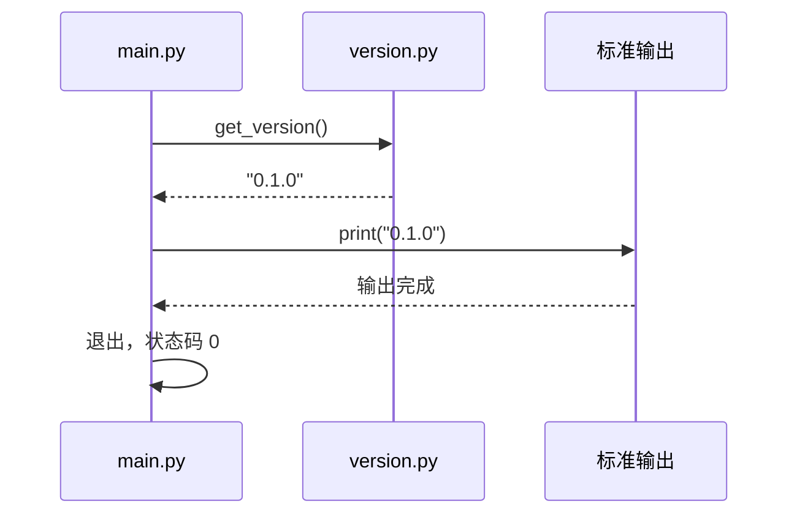
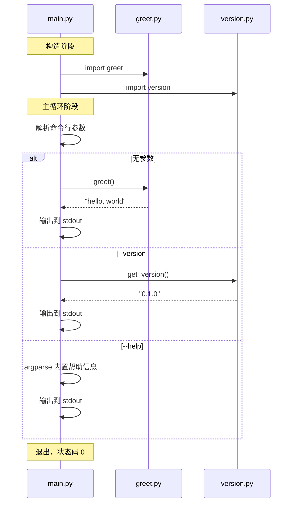

# 架构设计文档

## 概述

本文档描述 Python CLI 工具 "hello-world-cli" 的架构设计。该工具是一个简单的命令行应用程序，在运行时向标准输出打印 "hello, world" 字符串，支持版本查询（--version）和帮助信息（--help）功能。帮助信息通过 argparse 标准库内置支持，无需单独模块。

## 1. 系统上下文（C4Context）

**组件说明：**
- **终端用户**：通过终端/命令行与工具交互的任何人
- **hello-world-cli**：本项目的核心系统，提供打印问候语、版本查询和帮助信息显示功能
- **操作系统 Shell**：提供命令行执行环境，支持 Python 3.7+ 运行时

## 2. 容器分解（C4Container）

**容器说明：**
- **CLI Application**：主要的可执行容器，包含所有业务逻辑和命令行处理
- **应用配置**：内存中存储的配置数据（如版本号），无需持久化存储

## 3. 组件分解（C4Component）

**组件说明：**
- **main.py**：程序入口点，负责解析命令行参数并分发到对应的处理函数
- **greet.py**：问候语模块，负责生成和输出 "hello, world" 字符串
- **version.py**：版本模块，负责处理 --version 参数，返回版本字符串
- 帮助信息（--help）由 argparse 标准库内置支持，无需单独模块

## 4. 模块依赖关系

**依赖关系说明：**
- `main.py` 依赖 `greet.py` 和 `version.py`
- 所有模块仅依赖 Python 标准库（sys, argparse, os）
- 无第三方库依赖
- 帮助信息通过 argparse.ArgumentParser 内置的 `--help` 支持，无需额外模块

## 5. 模块职责定义

### 5.1 main.py（入口点）

**职责：** 程序入口，命令行参数解析，分发到对应处理函数

**公共方法：**

| 方法名 | 参数 | 返回类型 | 描述 |
|--------|------|----------|------|
| `main()` | 无 | `None` | 程序入口点，解析命令行参数并分发 |
| `build_parser()` | 无 | `ArgumentParser` | 构建参数解析器，支持 --version 和 --help |

### 5.2 greet.py（问候语模块）

**职责：** 生成和输出问候语 "hello, world"

**公共方法：**

| 方法名 | 参数 | 返回类型 | 描述 |
|--------|------|----------|------|
| `greet()` | 无 | `str` | 返回问候语字符串 "hello, world" |

### 5.3 version.py（版本模块）

**职责：** 处理版本查询，返回语义化版本号

**公共方法：**

| 方法名 | 参数 | 返回类型 | 描述 |
|--------|------|----------|------|
| `get_version()` | 无 | `str` | 返回版本字符串，格式为 "0.1.0" |

## 6. 数据模型

### 6.1 应用配置

| 字段 | 类型 | 约束 | 描述 |
|------|------|------|------|
| `version` | `str` | 非空，符合语义化版本 | 应用版本号，格式为 "X.Y.Z" |
| `name` | `str` | 非空 | 应用名称，固定为 "hello-world-cli" |

### 6.2 命令行参数

| 字段 | 类型 | 约束 | 描述 |
|------|------|------|------|
| `version` | `bool` | 默认 False | 是否请求版本信息 |
| `help` | `bool` | 默认 False | 是否请求帮助信息（argparse 内置） |
| `greet` | `bool` | 默认 True | 是否执行默认问候语输出 |

## 7. 组件交互流程

### 7.1 默认执行流程（无参数）

**步骤描述：**
1. 程序启动，进入 main.py 的 main() 函数
2. 检查命令行参数，发现无特殊参数
3. 调用 greet.py 的 greet() 方法
4. greet.py 返回 "hello, world" 字符串
5. main.py 将结果输出到 stdout
6. 程序正常退出，返回状态码 0

### 7.2 版本查询流程

**步骤描述：**
1. 程序启动，进入 main.py 的 main() 函数
2. 检查命令行参数，发现 --version 标志
3. 调用 version.py 的 get_version() 方法
4. version.py 返回 "0.1.0" 版本字符串
5. main.py 将版本信息输出到 stdout
6. 程序正常退出，返回状态码 0

## 8. 启动序列

## 9. 技术栈选型

### 9.1 编程语言

- **Python 3.7+**：选择 Python 是因为其简洁的语法、丰富的标准库和广泛的跨平台兼容性。Python 是命令行工具开发的首选语言，特别适合本项目的简单需求。

### 9.2 运行时

- **CPython**：Python 的标准实现，提供最佳的兼容性和性能。

### 9.3 框架

- **无外部框架**：本项目仅使用 Python 标准库（argparse, sys, os），不依赖任何第三方框架。这符合 NFR-002 的要求，确保零依赖。

### 9.4 包管理器

- **pip**：Python 标准的包管理器，用于管理项目依赖（本项目无外部依赖）。

### 9.5 测试框架

- **pytest**：Python 生态中最流行的测试框架，提供简洁的测试语法和强大的断言功能。

### 9.6 静态分析

- **ruff**：快速且功能丰富的 Python 代码检查工具，符合 PEP 8 规范。

## 10. 非功能需求映射

| 需求 ID | 需求描述 | 架构满足方式 |
|---------|----------|-------------|
| NFR-001 | 执行效率 < 1 秒 | 简单 print 操作，实际执行时间 < 100ms |
| NFR-002 | Python 3.7+ 兼容 | 仅使用标准库，无第三方依赖 |
| NFR-003 | 可靠性 | 无异常处理路径，始终输出正确内容 |
| NFR-004 | 可维护性 | 代码结构清晰，遵循 PEP 8 规范，文件 < 100 行 |

## 11. 技术约束与限制

1. **零第三方依赖**：项目仅使用 Python 标准库，确保在任何 Python 3.7+ 环境中可运行
2. **跨平台兼容**：代码不依赖操作系统特定功能，支持 Linux、macOS、Windows
3. **UTF-8 编码**：所有输出使用 UTF-8 编码，确保中文和其他 Unicode 字符正确显示
4. **简洁性优先**：源代码文件不超过 100 行，保持代码简洁可读

## 12. 扩展性考虑

- 若需自定义帮助信息，可在 `main.py` 的 `ArgumentParser` 中配置 `epilog` 参数
- 若需更多子命令，可引入 `argparse` 的子解析器（subparsers）
- 若需配置文件支持，可新增 config.py 模块
