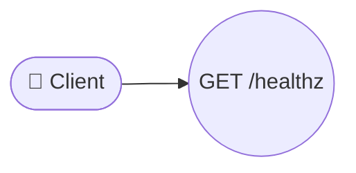
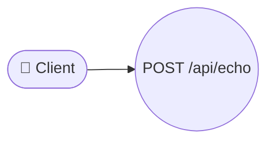
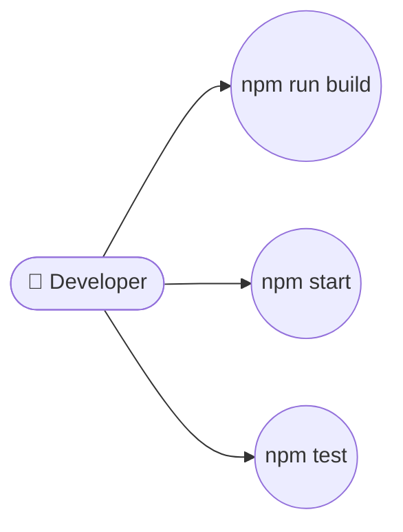
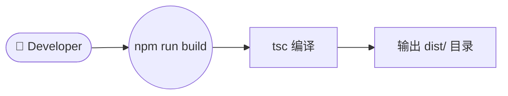
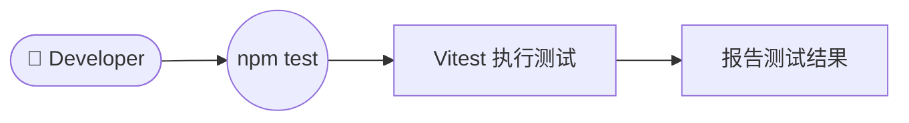

# 需求规格说明书 — TypeScript REST API Server

## 执行摘要

本文档定义了一个使用 Node.js 和 Express 构建的最小化 TypeScript REST API 服务器的需求。服务器提供两个端点：健康检查端点和回显端点。项目使用严格模式的 TypeScript，通过 `tsc` 打包，并包含 Vitest 单元测试。

## 功能需求

### FR-001: 健康检查端点

服务器必须提供一个 `GET /healthz` 端点，返回 JSON 响应 `{"status":"ok"}`，HTTP 状态码为 200。



**验收标准：**

- `GET /healthz` 请求必须返回 HTTP 200。
- 响应体必须是有效的 JSON，包含 `{"status":"ok"}`。
- 响应的 `Content-Type` 必须是 `application/json`。

### FR-002: 回显端点

服务器必须提供一个 `POST /api/echo` 端点，接收包含 `message` 字符串字段的 JSON 请求体，并返回该消息及其字符长度。



**验收标准：**

- 携带有效 JSON 请求体 `{"message":"<string>"}` 的 `POST /api/echo` 请求必须返回 HTTP 200。
- 响应体必须是有效的 JSON，包含 `{"echo":"<message>","length":<int>}`。
- `echo` 字段必须与输入的 `message` 字符串完全一致。
- `length` 字段必须等于 `message.length`（JavaScript 字符串长度）。
- 如果请求体缺失或 JSON 格式错误，服务器必须返回 HTTP 400。

### FR-003: 构建与打包配置

项目必须包含 `package.json`，其中定义构建、启动和测试的脚本。



**验收标准：**

- `package.json` 必须定义 `build`、`start` 和 `test` 脚本。
- `build` 脚本必须使用 `tsc` 编译 TypeScript。
- `test` 脚本必须运行 Vitest。

### FR-004: TypeScript 严格编译

项目必须在 `tsconfig.json` 中配置 `strict: true`。

**验收标准：**

- `tsconfig.json` 必须设置 `strict` 为 `true`。
- 编译后的 JavaScript 文件必须输出到 `dist/` 目录。

## 非功能需求

### NFR-001: 端口配置

服务器默认必须监听 **3000** 端口。

### NFR-002: 单进程架构

服务器必须以单进程方式运行，不使用集群或工作进程池。

### NFR-003: 无外部依赖

服务器在运行时不得连接任何数据库、不使用认证中间件、不依赖外部服务。

### NFR-004: 响应延迟

所有端点在标准开发机器上正常条件下必须在 **100 毫秒**内响应。

### NFR-005: 错误处理

服务器必须优雅地处理格式错误的 JSON 请求，返回 HTTP 400 和描述性错误消息。

### NFR-006: TypeScript 严格模式

所有源代码必须在 `strict` 模式下无错误地编译，不应不必要地使用 `any` 类型。

### NFR-007: 启动时间

服务器从启动到可接受请求必须在 **5 秒**内完成。

## 用例

### UC-001: 健康检查

- **参与者：** 客户端 / 监控系统
- **目标：** 验证服务器正在运行且处于健康状态
- **前置条件：** 服务器已启动并在 3000 端口监听

```mermaid
flowchart LR
  actor_monitor(["👤 Monitoring System"])
  uc_health_check(("Health Check"))
  actor_monitor --> uc_health_check
  uc_health_check --> response["返回 {\"status\":\"ok\"}"]
```

**主要流程：**

1. 客户端发送 `GET /healthz` 请求。
2. 服务器返回 `{"status":"ok"}`，HTTP 200。

**覆盖需求：** FR-001, NFR-001

### UC-002: 消息回显

- **参与者：** 客户端
- **目标：** 向服务器发送消息并获取回显及长度
- **前置条件：** 服务器已启动并在 3000 端口监听

```mermaid
flowchart LR
  actor_user(["👤 Client"])
  uc_echo_request(("POST /api/echo"))
  uc_echo_request --> uc_validate["验证请求体"]
  uc_validate --> uc_process["处理消息"]
  uc_process --> uc_response["返回 {\"echo\":...,\"length\":...}"]
  actor_user --> uc_echo_request
```

**主要流程：**

1. 客户端发送 `POST /api/echo` 请求，请求体为 `{"message":"hello"}`。
2. 服务器验证请求体包含有效的 JSON 和 `message` 字段。
3. 服务器计算 `message` 的字符长度。
4. 服务器返回 `{"echo":"hello","length":5}`，HTTP 200。

**异常流程：**

- 如果请求体不是有效的 JSON，服务器返回 HTTP 400。
- 如果请求体缺少 `message` 字段，服务器返回 HTTP 400。

**覆盖需求：** FR-002, NFR-005

### UC-003: 项目构建

- **参与者：** 开发者
- **目标：** 编译 TypeScript 源码为 JavaScript
- **前置条件：** 已安装 Node.js 和 npm



**主要流程：**

1. 开发者运行 `npm run build`。
2. `tsc` 读取 `tsconfig.json` 配置。
3. TypeScript 源码编译为 JavaScript 并输出到 `dist/` 目录。

**覆盖需求：** FR-003, FR-004

### UC-004: 运行测试

- **参与者：** 开发者
- **目标：** 运行单元测试验证功能正确性
- **前置条件：** 项目已构建



**主要流程：**

1. 开发者运行 `npm test`。
2. Vitest 执行所有单元测试文件。
3. 报告测试通过/失败结果。

**覆盖需求：** FR-003

## 约束

### C-001: 技术栈约束

- 必须使用 **TypeScript**（严格模式）作为开发语言。
- 必须使用 **Express** 作为 HTTP 框架。
- 必须使用 **Vitest** 作为测试框架。

### C-002: 架构约束

- 必须是单进程服务器，不使用集群。
- 不得连接数据库。
- 不得使用任何认证中间件。

### C-003: 部署约束

- 服务器必须在端口 3000 上运行。
- 必须提供 `build`、`start`、`test` 三个 npm 脚本。
