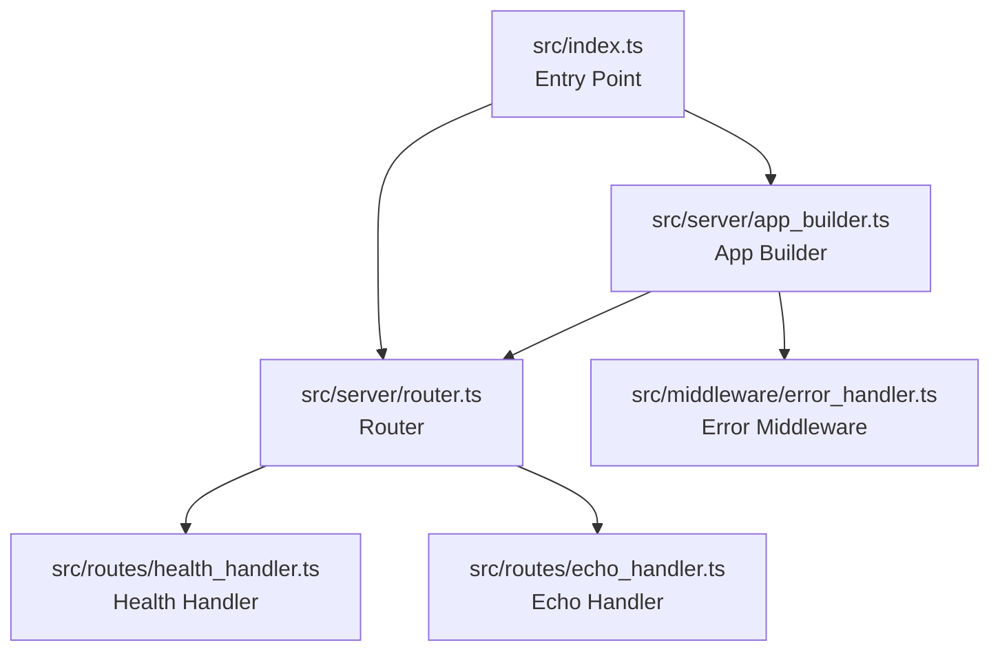
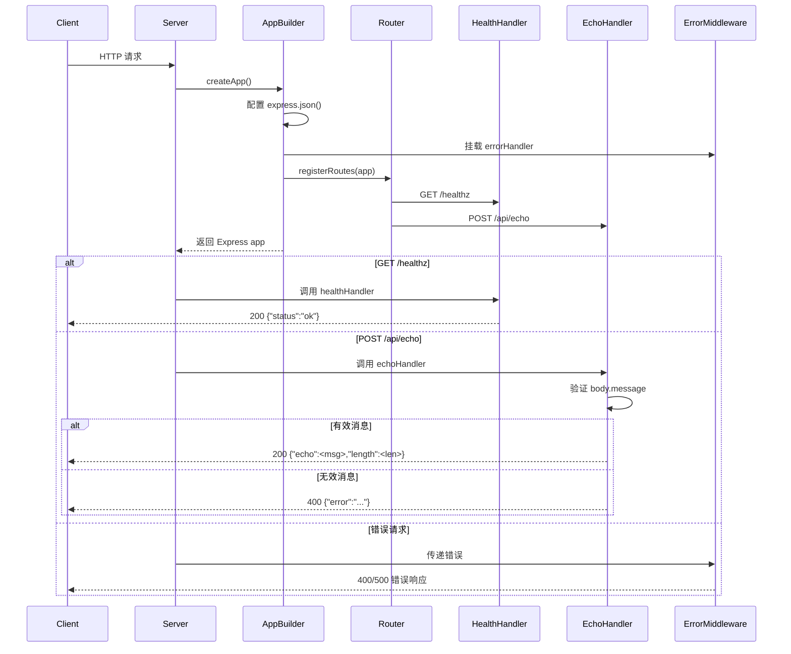
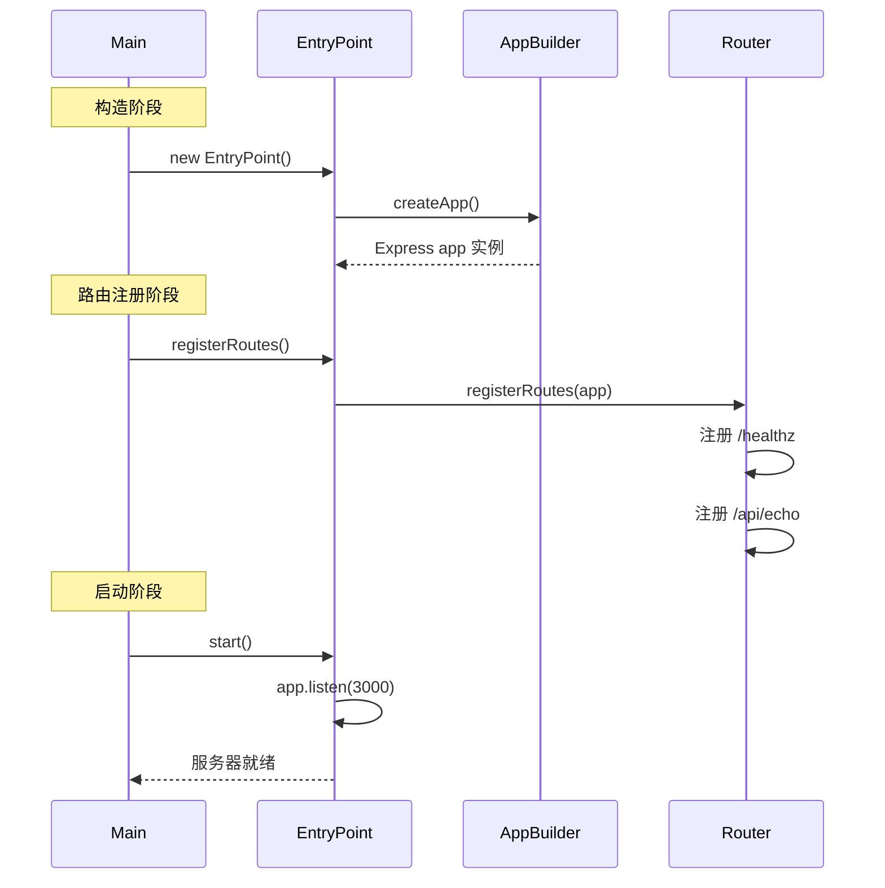
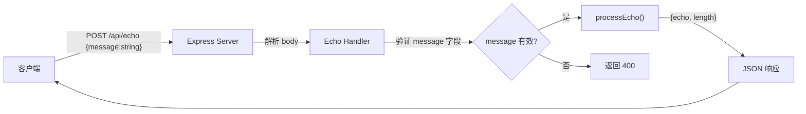

# 架构设计文档 — TypeScript REST API 服务器

## 1. 概述

本文档描述了一个基于 Node.js + Express 的 TypeScript REST API 服务器的架构设计。系统提供两个 HTTP 端点：健康检查（GET /healthz）和回显服务（POST /api/echo）。系统为单进程架构，不依赖数据库、认证中间件或外部服务。项目使用 TypeScript 严格模式编译，通过 tsc 打包，并包含 Vitest 单元测试。

## 2. 技术栈选型

| 层级 | 技术 | 理由 |
|------|------|------|
| 语言 | TypeScript（严格模式） | 类型安全，编译期检查，避免运行时错误 |
| 运行时 | Node.js（LTS） | 成熟的 HTTP 服务器运行时，Express 生态 |
| Web 框架 | Express.js | 轻量、成熟、社区广泛，适合小型 REST API |
| 测试框架 | Vitest | 与 TypeScript 原生兼容，速度快，与 Vite 生态一致 |
| HTTP 测试库 | Supertest | Express 官方推荐的 HTTP 测试库，可直接传入 app 实例 |
| 构建工具 | TypeScript 编译器（tsc） | 官方编译器，直接将 `.ts` 编译为 `.js` 输出到 `dist/` |
| 包管理 | npm | Node.js 标准包管理器 |

## 3. C4 上下文图

```mermaid
C4Context
  title 系统上下文图
  Person(client, "客户端 / 监控系统", "发送 HTTP 请求到服务器")
  System(api_server, "TypeScript REST API Server", "提供健康检查和回显服务的 Express 服务器")
  Rel(client, api_server, "HTTP / JSON", "REST API")
  UpdateLayoutConfig($c4ShapeWidth=300, $c4BoundaryWidth=200)
```

## 4. C4 容器图

```mermaid
C4Container
  title 容器分解图
  Person(client, "客户端", "HTTP 客户端")
  Container(server, "API Server", "Node.js + Express", "处理 HTTP 请求并路由到对应端点")
  Rel(client, server, "HTTP 请求", "REST API")
  UpdateLayoutConfig($c4ShapeWidth=300, $c4BoundaryWidth=200)
```

## 5. C4 组件图

### 5.1 API Server 容器组件分解

```mermaid
C4Component
  title API Server 组件分解
  Container(server, "API Server", "Node.js + Express")
  Component(entry, "Entry Point", "src/index.ts", "程序入口，负责构建 Express 应用、注册路由、启动监听")
  Component(app_builder, "App Builder", "src/server/app_builder.ts", "构建 Express 应用实例，配置中间件")
  Component(router, "Router", "src/server/router.ts", "定义并注册所有路由处理器")
  Component(health_handler, "Health Handler", "src/routes/health_handler.ts", "处理 GET /healthz 端点逻辑")
  Component(echo_handler, "Echo Handler", "src/routes/echo_handler.ts", "处理 POST /api/echo 端点业务逻辑")
  Component(error_middleware, "Error Middleware", "src/middleware/error_handler.ts", "处理 JSON 解析错误和全局错误处理")

  Rel(entry, app_builder, "调用")
  Rel(entry, router, "调用")
  Rel(app_builder, router, "使用")
  Rel(router, health_handler, "路由到")
  Rel(router, echo_handler, "路由到")
  Rel(app_builder, error_middleware, "挂载")
  UpdateLayoutConfig($c4ShapeWidth=300, $c4BoundaryWidth=200)
```

## 6. 模块分解与职责

### 6.1 模块列表

| 模块 ID | 模块名 | 文件路径 | 职责 |
|---------|--------|----------|------|
| M-001 | Entry Point | `src/index.ts` | 程序入口，构建应用，启动服务器监听 |
| M-002 | App Builder | `src/server/app_builder.ts` | 创建 Express 应用实例，配置中间件 |
| M-003 | Router | `src/server/router.ts` | 定义路由映射，注册所有端点 |
| M-004 | Health Handler | `src/routes/health_handler.ts` | 实现健康检查端点逻辑 |
| M-005 | Echo Handler | `src/routes/echo_handler.ts` | 实现回显端点业务逻辑 |
| M-006 | Error Middleware | `src/middleware/error_handler.ts` | 处理 JSON 解析错误和全局错误 |

### 6.2 模块依赖关系



### 6.3 模块依赖说明

- **Entry Point** (`src/index.ts`)：依赖 App Builder 和 Router，负责初始化并启动服务器。
- **App Builder** (`src/server/app_builder.ts`)：依赖 Router 和 Error Middleware，负责组装 Express 应用。
- **Router** (`src/server/router.ts`)：依赖 Health Handler 和 Echo Handler，负责路由映射。
- **Health Handler** (`src/routes/health_handler.ts`)：无依赖，纯函数实现。
- **Echo Handler** (`src/routes/echo_handler.ts`)：无依赖，纯函数实现。
- **Error Middleware** (`src/middleware/error_handler.ts`)：无依赖，Express 中间件函数。

## 7. 接口定义

### 7.1 Entry Point（M-001）

**类**：`EntryPoint`（`src/index.ts`）

| 方法 | 参数 | 返回类型 | 描述 |
|------|------|----------|------|
| `constructor()` | 无 | — | 创建 EntryPoint 实例，内部调用 `createApp()` 构建 Express 应用 |
| `registerRoutes()` | 无 | `void` | 调用 `registerRoutes()` 将所有路由注册到 Express 应用 |
| `start()` | 无 | `void` | 启动 HTTP 服务器，监听端口 3000（可通过 `PORT` 环境变量覆盖） |

### 7.2 App Builder（M-002）

**函数**：`createApp()`（`src/server/app_builder.ts`）

| 函数 | 参数 | 返回类型 | 描述 |
|------|------|----------|------|
| `createApp()` | 无 | `Express` | 创建 Express 应用实例，配置 `express.json()` 中间件，挂载错误处理中间件，返回已配置的 app 实例 |

### 7.3 Router（M-003）

**函数**：`registerRoutes()`（`src/server/router.ts`）

| 函数 | 参数 | 返回类型 | 描述 |
|------|------|----------|------|
| `registerRoutes(app)` | `app: Express` | `void` | 在给定 Express 应用上注册所有路由处理器 |

### 7.4 Health Handler（M-004）

**函数**：`healthHandler()`（`src/routes/health_handler.ts`）

| 函数 | 参数 | 返回类型 | 描述 |
|------|------|----------|------|
| `healthHandler(req, res)` | `req: Request`, `res: Response` | `void` | 处理 GET /healthz，返回 HTTP 200 和 `{"status":"ok"}` |

### 7.5 Echo Handler（M-005）

**函数**：`echoHandler()`（`src/routes/echo_handler.ts`）

| 函数 | 参数 | 返回类型 | 描述 |
|------|------|----------|------|
| `echoHandler(req, res)` | `req: Request`, `res: Response` | `void` | 处理 POST /api/echo，验证请求体包含 `message` 字符串字段，返回 `{"echo":<message>,"length":<int>}` |

**接口**：`EchoResponse`

| 字段 | 类型 | 约束 |
|------|------|------|
| `echo` | `string` | 与输入 `message` 完全一致 |
| `length` | `number` | 等于 `message.length` |

### 7.6 Error Middleware（M-006）

**函数**：`errorHandler()`（`src/middleware/error_handler.ts`）

| 函数 | 参数 | 返回类型 | 描述 |
|------|------|----------|------|
| `errorHandler(err, req, res, next)` | `err: Error`, `req: Request`, `res: Response`, `next: NextFunction` | `void` | Express 错误处理中间件，捕获 JSON 解析错误返回 HTTP 400，其他错误返回 HTTP 500 |

## 8. 组件交互流程

### 8.1 请求处理流程



### 8.2 启动流程



## 9. 数据模型

### 9.1 EchoResponse

| 字段 | 类型 | 约束 |
|------|------|------|
| `echo` | `string` | 与请求 `message` 字段完全一致 |
| `length` | `number` | 等于 `message.length` |

### 9.2 EchoRequest

| 字段 | 类型 | 约束 |
|------|------|------|
| `message` | `string` | 必填，非空字符串 |

### 9.3 ErrorResponse

| 字段 | 类型 | 约束 |
|------|------|------|
| `error` | `string` | 描述性错误消息 |

### 9.4 数据流图



## 10. 错误处理策略

服务器采用分层错误处理策略：

1. **JSON 解析错误**：Express 内置 `express.json()` 中间件在解析失败时抛出 `SyntaxError`，由 `errorHandler` 中间件捕获，返回 HTTP 400 和描述性消息。
2. **业务逻辑错误**：Echo Handler 在 `message` 字段缺失或类型不匹配时直接返回 HTTP 400。
3. **未处理异常**：`errorHandler` 捕获所有其他错误，返回 HTTP 500。

## 11. 测试策略

- **单元测试**：使用 Vitest 对 `processEcho()` 函数进行单元测试，覆盖正常输入、空字符串、单字符、Unicode、长字符串等边界情况。
- **集成测试**：使用 Supertest 对 Express 应用进行端到端测试，验证路由注册和中间件配置。
- **编译验证**：验证 `tsc` 编译成功且输出文件存在于 `dist/` 目录。

## 12. 子系统与目录结构

| 子系统 | 目录 | 组件 |
|--------|------|------|
| server | `src/server/` | app_builder.ts, router.ts |
| routes | `src/routes/` | health_handler.ts, echo_handler.ts |
| middleware | `src/middleware/` | error_handler.ts |
| 入口 | `src/` | index.ts |

## 13. 构建与运行

```
npm run build    # 使用 tsc 编译 TypeScript
npm start        # 运行编译后的服务器（node dist/index.js）
npm test         # 运行 Vitest 测试
```
